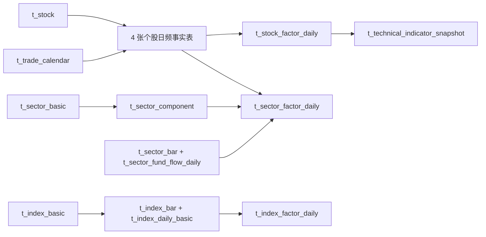

# 历史数据资产初始化

## 结论

历史初始化固定为 6 个手动任务，按“个股 → 板块 → 指数”，每类资产内部按“日频事实 → 日频因子”执行。历史分钟线和历史分钟因子不纳入初始化；分钟资产只由项目运行后的每日收盘与实时链路逐步积累。

```text
backfill_stock_daily_facts
  -> backfill_stock_daily_factors
  -> backfill_sector_daily_facts
  -> backfill_sector_daily_factors
  -> backfill_index_daily_facts
  -> backfill_index_daily_factors
```

先使用目标表 owner 或数据库管理员账号执行 `docs/sql/55-data-asset-history-pipelines.sql`，再执行仅包含 DML 的 `docs/sql/56-sector-history-range-backfill.sql`，最后 reload Scheduler。仅有 DML 读写权限的应用账号无法对已有表执行 `ALTER TABLE`，但可以执行 `56` 更新既有任务定义。`55` 会 seed 上述 6 个任务、增加 `t_stock_factor_daily.ma30/ma60`、创建 `t_index_factor_daily`，并删除 7 个已被替换的旧任务定义；`t_scheduler_job_run` 中的旧运行记录不删除。

## 主数据前置条件

以下 4 个主数据任务保持原规划，不纳入历史任务合并：

| 顺序 | 任务 | 主表 | 作用 |
| --- | --- | --- | --- |
| 1 | `sync_stock_basic` | `t_stock` | 建立沪深 active 股票范围和代码规范。 |
| 2 | `sync_sector_catalog` | `t_sector_basic`、`t_sector_component` | 建立板块目录和当前成分关系。 |
| 3 | `sync_index_catalog` | `t_index_basic`、`t_index_component` | 建立核心指数目录和当前成分关系。 |
| 4 | `sync_trade_calendar` | `t_trade_calendar` | 提供日期范围展开、最近交易日和任务跳过判断。 |

历史任务只有在这些主数据可用后才执行。`pool_code=all_a_share` 读取 `t_stock.status=active` 的沪深动态范围；板块事实依赖 Tushare THS 板块映射；指数事实读取 `t_index_basic` 清单与 `metadata.official_index_code`。

## 数据资产表与关系

| 资产 | 层级 | 主键/业务键 | 上游 | 下游 |
| --- | --- | --- | --- | --- |
| `t_stock` | Master | `stock_code` | `sync_stock_basic` | 全部个股事实、股票池、板块/指数成分。 |
| `t_trade_calendar` | Master | `trade_date + market` | `sync_trade_calendar` | 所有历史任务的交易日范围。 |
| `t_sector_basic` | Master | `sector_code` | `sync_sector_catalog` | `t_sector_component`、板块事实与因子。 |
| `t_sector_component` | Master | `sector_code + stock_code + source` | `sync_sector_catalog` | 板块成分上涨数、涨停数和资金流聚合。 |
| `t_index_basic` | Master | `index_code` | `sync_index_catalog` | 指数历史事实任务的指数清单。 |
| `t_index_component` | Master | `index_code + stock_code` | `sync_index_catalog` | 指数当前成分展示；当前指数因子不依赖成分。 |
| `t_daily_bar` | Canonical | `stock_code + trade_date` | Tushare `daily` | 个股日频因子、技术快照、板块成分聚合。 |
| `t_stock_daily_basic` | Canonical | `stock_code + trade_date` | Tushare `daily_basic` | 估值/换手页面；当前系统自算因子不直接依赖。 |
| `t_stock_fund_flow_daily` | Canonical | `stock_code + trade_date` | Tushare `moneyflow` | 个股资金因子、板块成分资金聚合。 |
| `t_stock_technical_factor_daily` | Canonical | `stock_code + trade_date` | Tushare `stk_factor_pro` | 常用专业指标摘要写入 `t_stock_factor_daily.features.tushare_technical`。 |
| `t_stock_factor_daily` | Derived | `stock_code + trade_date + source` | 日线、个股资金流、专业技术因子 | 技术快照、个股行情页和后续选股/回测。 |
| `t_technical_indicator_snapshot` | Derived | `stock_code + snapshot_time + source` | 日线和个股日频因子 | 个股行情页收盘技术状态。 |
| `t_minute_bar` | Canonical | `stock_code + trade_date + bar_time + interval + source` | 每日/实时链路 | 近期分钟展示和近期分钟因子。 |
| `t_stock_factor_minute` | Derived | 分钟业务键 | 近期 `t_minute_bar` | 近期盘中展示；不由历史初始化生成。 |
| `t_sector_bar` | Canonical | `sector_code + trade_date` | Tushare `ths_daily` | 板块波动率、量能异动和涨跌幅。 |
| `t_sector_fund_flow_daily` | Canonical | `sector_code + trade_date` | `moneyflow_cnt_ths`、`moneyflow_ind_ths` | 板块资金强度、连续流入和窗口净流入。 |
| `t_limit_event_daily` | Canonical | `stock_code + trade_date + event_type` | 每日核心沉淀 | 板块涨停成分数。 |
| `t_sector_factor_daily` | Derived | `sector_code + trade_date` | 板块行情/资金流、当前成分、个股日线/资金流、涨停事件 | 板块详情和板块资金大屏。 |
| `t_index_bar` | Canonical | `index_code + trade_date` | Tushare `index_daily` | 指数趋势、收益、波动和量额因子。 |
| `t_index_daily_basic` | Canonical | `index_code + trade_date` | Tushare `index_dailybasic` | 指数估值、换手因子。 |
| `t_index_factor_daily` | Derived | `index_code + trade_date` | 指数日线和指数每日指标 | 指数历史分析。 |

关系主干如下：



> `t_sector_component` 和 `t_index_component` 当前是“当前主数据”，不是 point-in-time 历史成分快照。`t_sector_factor_daily` 的成分股派生项因此按当前有效成员回算，存在幸存者偏差；板块自身行情和资金流字段不受该限制。需要严格历史回测时，应另建带有效期的成分快照资产，不能把当前成分结果解释为历史时点真实成分。

## 6 个任务的行为

### 个股日频事实

`backfill_stock_daily_facts` 依次运行 4 个事实阶段。每个阶段按股票队列处理，每只股票对对应 Tushare 接口只发起一次完整 `start_date/end_date` 区间请求：

| 阶段 | 接口 | 落表 | 单位处理 |
| --- | --- | --- | --- |
| 日 K | `daily` | `t_daily_bar` | `vol` 手；同时写股数，`amount` 千元转元。 |
| 估值/流动性 | `daily_basic` | `t_stock_daily_basic` | 保留 Tushare 日频估值与市值字段。 |
| 个股资金流 | `moneyflow` | `t_stock_fund_flow_daily` | 万元转元。 |
| 专业技术因子 | `stk_factor_pro` | `t_stock_technical_factor_daily` | 原始专业字段存入 JSONB `factors`。 |

任务默认 `append_safe + only_missing=true`，可重复续跑。任一事实阶段的单股失败进入结果摘要，后续股票继续；下一次运行会重试缺口。`rebuild` 会先删除指定股票池和日期范围内的 4 类事实再重新拉取，应只在明确需要全量重建时使用。

### 个股日频因子与技术快照

`backfill_stock_daily_factors` 一次完成：

1. 以 `factor_window_trade_days=20` 划分日期窗口。
2. 每个窗口以 `sql_stock_chunk_size=200` 划分股票范围。
3. PostgreSQL 使用窗口函数和 `INSERT ... SELECT` 写 `t_stock_factor_daily`。
4. 再以同样窗口和分片，直接从日线与日频因子集合生成 `t_technical_indicator_snapshot`。

系统自算字段包括 `ma5/ma10/ma20/ma30/ma60`、`return_1d`、`amplitude`、5 日量比/额比、`volatility_20d` 和 `close_position`。资金流扩展包括主力/大单/超大单净流入占比、3/5/10 日净流入、连续流入日和横截面强度；Tushare 专业因子摘要保存在 `features.tushare_technical`。

历史技术快照不读取或生成分钟因子：`last_price/change_pct` 来自 `t_daily_bar`，`trend_score` 来自日频均线与收益，`intraday_strength` 在无分钟输入时使用日涨跌幅，`volume_score` 为 `NULL`。每日收盘任务仍可用近期分钟线生成更完整的当日快照。

### 板块日频事实与因子

`backfill_sector_daily_facts` 从 `tushare_ths_sector_map` 读取 THS 板块代码，按板块队列并发；每个板块只调用一次 `ths_daily(ts_code, start_date, end_date)` 获取整个历史区间，并在单板块完成后提交 `t_sector_bar`。`workers` 只控制板块日 K，并发默认 12、上限 20。`append_safe` 会先查指定板块已有交易日；目标区间已完整覆盖时不再请求，存在缺口时重新请求整个区间并用业务键 upsert。

板块资金流是另一类全市场区间接口：以默认 20 个交易日窗口调用 `moneyflow_cnt_ths/moneyflow_ind_ths`，由独立的 `moneyflow_workers=2` 控制并发，上限 4。这个窗口经过真实接口逐日对账：2026-07-13 至 2026-07-17 的 5 日区间与逐日请求分别得到概念 1910 行、行业 450 行，业务键集合完全相同；2026-06-22 至 2026-07-17 的 20 日区间与 20 次逐日请求分别都得到概念 7647 行、行业 1800 行，覆盖 20/20 个交易日，重复键、键差集和同键字段值差异均为 0。因此当前默认值以 20 日实测边界为准，若上游接口或账号权限变化，应重新做逐日对账后再调整。

`max_sectors` 只限制板块日 K 的板块数量，便于 smoke；`moneyflow_cnt_ths/moneyflow_ind_ths` 返回全市场板块资金流，因此不会随 `max_sectors` 截断。`rebuild` 会先删除目标日期区间的板块日 K 和板块资金流，不能配合小范围 smoke 使用。

`backfill_sector_daily_factors` 读取 `t_sector_bar/t_sector_fund_flow_daily/t_sector_component/t_daily_bar/t_stock_fund_flow_daily/t_limit_event_daily`，计算板块资金强度、3/5/10 日净流入、连续流入、上涨/涨停成分数、成分平均涨幅、20 日波动率、净流入成分占比、量能异动比和标签。默认只开 2 个交易日计算 worker，上限 4。

### 指数日频事实与因子

`backfill_index_daily_facts` 从 `t_index_basic` 读取指数清单，每个指数对 `index_daily`、`index_dailybasic` 各发起一次完整区间请求，分别写 `t_index_bar` 和 `t_index_daily_basic`。

`backfill_index_daily_factors` 使用 PostgreSQL 窗口函数写 `t_index_factor_daily`，字段包括 `ma5/ma10/ma20/ma30/ma60`、单日收益、振幅、5 日量比/额比、20 日波动率，以及 `turnover_rate/pe_ttm/pb`。

## 并发与限频

Tushare 的真实吞吐上限由配置中心 `market_data/tushare_pro.rate_limit_per_minute` 和 Token 权限共同决定。运行时每次调用都读取数据源中已启用的配置值；例如配置为 600 时，本地滑动窗口限频器就按每 Token 每分钟 600 次预留配额。代码中的 60 只在该配置项缺失、未启用或为空时作为安全兜底，不会覆盖数据源中的 600。worker 不能绕过限频器。

`cooldown_seconds` 也来自同一数据源。当 Tushare 上游真正返回限频错误时，当前 Token 才会被标记为 `cooldown`，并在配置的秒数内不再参与候选；本地滑动窗口配额用完时，调度调用会在 `scheduler_max_wait_seconds` 预算内等待可用配额，不会直接把 Token 进入 cooldown。

外部请求 worker 的估算公式是：

```text
worker ≈ 目标每秒请求数 × 单请求平均耗时秒数
```

每分钟 600 次等于每秒 10 次；单请求平均耗时约 0.8–1.2 秒时，需要约 8–12 个并发才能接近上限。因此个股事实和板块日 K 默认均采用 12 个请求 worker，上限 20；不直接设成 20，是为了给数据库连接池、调用日志写入和其他在线请求留余量。板块资金流是全市场区间查询，独立使用 2 个窗口 worker。默认数据库池为 `pool_size=10 + max_overflow=20`，且调度器允许 2 个全局并发任务，所以不要同时运行两个全市场历史外部任务。

建议先按 12 运行并观察 `t_runtime_call_log.latency_ms`、限频等待、Token cooldown、数据库池状态和失败率：

- 调用延迟高且没有限频等待，可逐步提高到 16。
- 已稳定触发本地限频等待时，提高 worker 不会增加吞吐。
- 出现数据库池等待、连接中断或提交耗时上升时，降到 8–10，并调小提交批次。
- 多个 Token 只有在确实拥有独立配额时才能叠加；同一账户配额拆成多个 Token 不应按 Token 数简单相乘。

因子任务不是网络 I/O 任务，不按 Tushare 频率设置高线程。个股和指数使用 PostgreSQL 集合计算；板块因子保留 2 个并行日期 worker，是数据库负载和时长之间的保守平衡。

## 推荐执行与验证

首次执行每一步都先 smoke，再扩大范围：

| 任务 | Smoke 参数 |
| --- | --- |
| `backfill_stock_daily_facts` | `max_stocks=1`，`start_date=end_date`。 |
| `backfill_stock_daily_factors` | `max_stocks=5`，单交易日。 |
| `backfill_sector_daily_facts` | 单交易日，`max_sectors=5`、`workers=5`、`moneyflow_workers=1`。必须使用 `append_safe`。 |
| `backfill_sector_daily_factors` | 单交易日，`calculation_workers=1`。 |
| `backfill_index_daily_facts` | `max_indexes=1`，短日期区间。 |
| `backfill_index_daily_factors` | `max_indexes=1`，短日期区间。 |

每一步确认 `t_scheduler_job_run.result_summary` 的目标数（个股看 `stock_count`，指数看 `index_count`）、完成数、失败数、写入行数和 warning 后，再扩大到完整日期范围。默认使用 `append_safe`；中断后直接用同一 payload 重跑，不需要先清理已经提交的批次。
