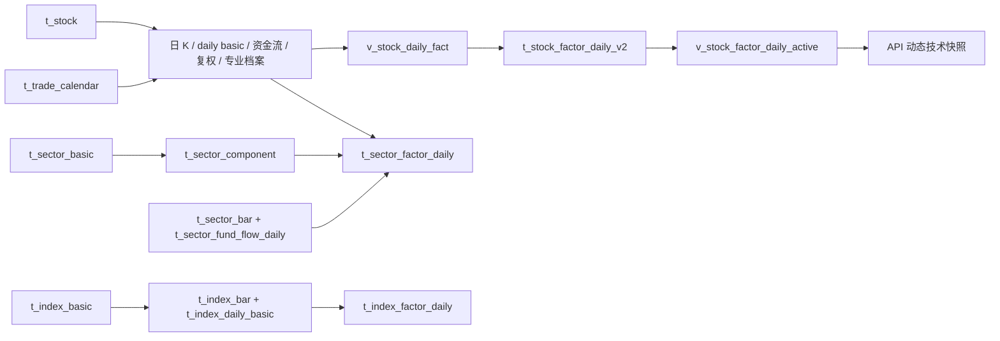

# 历史数据资产初始化

## 结论

历史初始化固定为 6 个手动任务，按“个股 → 板块 → 指数”，每类资产内部按“日频事实 → 日频因子”执行。个股因子已升级为 QFQ 标准因子 V2；历史分钟线和历史分钟因子不纳入初始化，分钟资产只由项目运行后的每日链路积累并保留 30 个交易日。

```text
backfill_stock_daily_facts
  -> backfill_stock_daily_factors
  -> backfill_sector_daily_facts
  -> backfill_sector_daily_factors
  -> backfill_index_daily_facts
  -> backfill_index_daily_factors
```

新库按顺序执行 `55/56/57` 后，再由目标表 owner 执行 `docs/sql/72-stock-daily-asset-convergence-v2.sql` 并 reload Scheduler。`72` 只新增影子资产、视图和轻量审计并更新任务定义，不删除旧事实；V1 保持 active、V2 保持 shadow。完成 2020-01-01 起的个股事实预热、2021-01-01 起的 V2 因子回填以及至少 5 个完整交易日影子观察后，只有校验视图通过才执行 `73-activate-stock-daily-factor-v2.sql`。需要语义回滚时执行 `74-rollback-stock-daily-factor-v1.sql`。

## 主数据前置条件

以下 4 个主数据任务保持原规划，不纳入历史任务合并：

| 顺序 | 任务 | 主表 | 作用 |
| --- | --- | --- | --- |
| 1 | `sync_stock_basic` | `t_stock` | 建立沪深 active 股票范围和代码规范。 |
| 2 | `sync_sector_catalog` | `t_sector_basic`、`t_sector_component` | 建立板块目录和当前成分关系。 |
| 3 | `sync_index_catalog` | `t_index_basic`、`t_index_component` | 建立核心指数目录和当前成分关系。 |
| 4 | `sync_trade_calendar` | `t_trade_calendar` | 提供日期范围展开、最近交易日和任务跳过判断。 |

历史任务只有在这些主数据可用后才执行。`pool_code=all_a_share` 读取 `t_stock.status=active` 的沪深动态范围；板块事实依赖 Tushare THS 板块映射；指数事实读取 `t_index_basic` 清单与 `metadata.official_index_code`。

## 数据资产表与关系

| 资产 | 层级 | 主键/业务键 | 上游 | 下游 |
| --- | --- | --- | --- | --- |
| `t_stock` | Master | `stock_code` | `sync_stock_basic` | 全部个股事实、股票池、板块/指数成分。 |
| `t_trade_calendar` | Master | `trade_date + market` | `sync_trade_calendar` | 所有历史任务的交易日范围。 |
| `t_sector_basic` | Master | `sector_code` | `sync_sector_catalog` | `t_sector_component`、板块事实与因子。 |
| `t_sector_component` | Master | `sector_code + stock_code + source` | `sync_sector_catalog` | 板块成分上涨数、涨停数和资金流聚合。 |
| `t_index_basic` | Master | `index_code` | `sync_index_catalog` | 指数历史事实任务的指数清单。 |
| `t_index_component` | Master | `index_code + stock_code` | `sync_index_catalog` | 指数当前成分展示；当前指数因子不依赖成分。 |
| `t_daily_bar` | Canonical | `stock_code + trade_date` | Tushare `daily` | 唯一 BFQ 行情、V2 因子和板块成分聚合。 |
| `t_stock_daily_basic` | Canonical | `stock_code + trade_date` | Tushare `daily_basic` | 换手、Provider 量比、估值、股本和市值。 |
| `t_stock_fund_flow_daily` | Canonical | `stock_code + trade_date` | Tushare `moneyflow` | 个股资金因子、板块成分资金聚合。 |
| `t_stock_adjust_factor` | Canonical | `stock_code + trade_date` | Tushare `adj_factor` | 本地 QFQ 回退与除权校验。 |
| `t_stock_technical_factor_daily` | Canonical archive | `stock_code + trade_date` | Tushare `stk_factor_pro` | 唯一保存 BFQ/QFQ/HFQ 专业全量 JSON 的档案。 |
| `v_stock_daily_fact` | Read view | `stock_code + trade_date` | 三张窄事实表 | 页面、质量检查和因子输入的统一事实口径。 |
| `t_stock_factor_daily_v2` | Derived | `stock_code + trade_date + factor_set_version` | 日线、复权、daily basic、资金流和专业档案 | QFQ 类型化标准因子。 |
| `v_stock_factor_daily_active` | Read view | 激活版本业务键 | V1/V2 因子表 | 页面、策略和回测统一读取。 |
| `t_stock_factor_daily` | Legacy derived | `stock_code + trade_date + source` | V1 日频计算 | 影子观察与语义回滚；V2 激活前保持在线。 |
| `t_provider_ingest_audit` | Audit | `trace_id` | 所有历史/每日 Provider 调用 | 完成、合法零行、失败和覆盖率判断。 |
| `t_technical_indicator_snapshot` | Legacy derived | 旧业务键 | V1 历史 | 已停止生产，仅在回滚观察期保留；API 动态生成快照。 |
| `t_minute_bar` | Canonical | `stock_code + trade_date + bar_time + interval + source` | 每日/实时链路 | 近期分钟展示和近期分钟因子。 |
| `t_stock_factor_minute` | Derived | 分钟业务键 | 近期 `t_minute_bar` | 近期盘中展示；不由历史初始化生成。 |
| `t_sector_bar` | Canonical | `sector_code + trade_date` | Tushare `ths_daily` | 板块波动率、量能异动和涨跌幅。 |
| `t_sector_fund_flow_daily` | Canonical | `sector_code + trade_date` | `moneyflow_cnt_ths`、`moneyflow_ind_ths` | 板块资金强度、连续流入和窗口净流入。 |
| `t_limit_event_daily` | Canonical | `stock_code + trade_date + event_type` | 每日核心沉淀、历史个股事实回填 | 板块涨停成分数。 |
| `t_sector_factor_daily` | Derived | `sector_code + trade_date` | 板块行情/资金流、当前成分、个股日线/资金流、涨停事件 | 板块详情和板块资金大屏。 |
| `t_index_bar` | Canonical | `index_code + trade_date` | Tushare `index_daily` | 指数趋势、收益、波动和量额因子。 |
| `t_index_daily_basic` | Canonical | `index_code + trade_date` | Tushare `index_dailybasic` | 指数估值、换手因子。 |
| `t_index_factor_daily` | Derived | `index_code + trade_date` | 指数日线和指数每日指标 | 指数历史分析。 |

关系主干如下：



> `t_sector_component` 和 `t_index_component` 当前是“当前主数据”，不是 point-in-time 历史成分快照。`t_sector_factor_daily` 的成分股派生项因此按当前有效成员回算，存在幸存者偏差；板块自身行情和资金流字段不受该限制。需要严格历史回测时，应另建带有效期的成分快照资产，不能把当前成分结果解释为历史时点真实成分。

## 6 个任务的行为

### 个股日频事实

`backfill_stock_daily_facts` 依次运行 6 个事实阶段。前 5 个阶段按股票队列处理，每只股票对对应 Tushare 接口只发起一次完整 `start_date/end_date` 区间请求；事件阶段改为按交易日查询全市场，避免逐股票放大请求。默认起点为 2020-01-01，用于给 2021-01-01 的 V2 因子提供约 250 个交易日预热：

| 阶段 | 接口 | 落表 | 单位处理 |
| --- | --- | --- | --- |
| 日 K | `daily` | `t_daily_bar` | `vol` 手；同时写股数，`amount` 千元转元。 |
| 估值/流动性 | `daily_basic` | `t_stock_daily_basic` | 保留 Tushare 日频估值与市值字段。 |
| 复权因子 | `adj_factor` | `t_stock_adjust_factor` | 保存单一复权因子，供本地 QFQ 回退与校验。 |
| 个股资金流 | `moneyflow` | `t_stock_fund_flow_daily` | 万元转元。 |
| 专业技术因子 | `stk_factor_pro` | `t_stock_technical_factor_daily` | 原始专业字段存入 JSONB `factors`。 |
| 涨跌停与停牌事件 | `limit_list_d`、`suspend_d` | `t_limit_event_daily` | 每个交易日各请求一次；U/D/Z 映射为 `limit_up/limit_down/limit_break`，停牌映射为 `suspend`；类别为空但带 `up_stat` 的历史响应按 U 池处理。 |

任务默认 `append_safe + only_missing=true`，可重复续跑。前 5 个事实阶段按业务键日期判断单股缺口；所有请求把脱敏参数、请求字段、返回/映射行数、哈希和状态写入 `t_provider_ingest_audit`。事件即使当天两个接口都返回 0 行，也以 `complete_zero` 作为范围完成标记。`max_stocks` 会同时限制逐股事实和事件入库范围，并使用独立完成范围。单股或单事件交易日失败进入结果摘要，下一次运行重试缺口。影子验证期应使用 `append_safe`；`rebuild` 会删除目标范围事实，不用于 smoke 或日常续跑。

2026-07-20 使用真实数据源对 2026-07-17 做过端到端验证：`limit_list_d` 返回 235 行（U/D/Z 分别为 33/192/10），`suspend_d` 返回 7 行；按当前沪深 active 范围映射并 Upsert 239 行，结果为 `limit_up=32`、`limit_down=192`、`limit_break=9`、`suspend=6`。同一 payload 第二次执行命中完成标记，跳过 1 个交易日且不再发起接口请求。

全区间回填还验证出 Tushare 在 2025-12-16 至 2026-03-31 的部分 U 池响应中 `limit=NULL`，但同时提供正涨幅、`fd_amount`、`up_stat` 和 `first_time`。Adapter 以 `up_stat` 作为该兼容分支的确定性标志，避免把真实涨停错误写成通用 `limit_event`；显式 D/Z 始终优先，不受该分支影响。

2026-07-20 已完成 2021-01-04 至 2026-07-17 的事件基线：1,341 个实际日 K 交易日全部存在完成标记和事件数据，共 135,477 行，其中 `limit_up=79,356`、`limit_down=19,705`、`limit_break=30,131`、`suspend=6,285`，业务键重复组为 0。完成标记比实际日 K 日期多 1 个，是因为当前 `t_trade_calendar` 将无日 K 的 2024-02-09 标为开市日；该日期两个事件接口均返回 0 行并被安全记录，不影响实际交易日覆盖。

### 个股标准日频因子 V2

`backfill_stock_daily_factors` 一次完成：

1. 从 2021-01-01 起以日期窗口划分目标区间，并额外读取约 550 个自然日以覆盖 250 个交易日预热。
2. 每个窗口以 `sql_stock_chunk_size=200` 划分股票范围，避免全市场单事务和超时。
3. PostgreSQL 从窄事实、复权历史和专业档案组装类型化列，幂等写 `t_stock_factor_daily_v2`。
4. `append_safe + only_missing=true` 只跳过 `factor_status=ready` 的 V2 行；`partial` 会在事实补齐后重新组装。

标准列包括 QFQ OHLC、MA5/10/20/30/60/90/250、EMA、MACD、KDJ、RSI、BOLL、ATR、CCI、VR、WR、BIAS、OBV、MFI、ROC、MTM；本地收益、振幅、量额比、波动率、高低点与回撤；主力/大单/超大单净流入及窗口累计；以及换手率和市值服务列。专业全量 JSON 不复制进标准表。

每行保存 `price_basis=qfq`、`factor_status`、`source_map` 和 `missing_factors`。专业 QFQ 为主源；缺失时仅在目标日期之前复权因子历史完整的情况下本地回退，否则保留空值并标为 `partial`，避免 BFQ/QFQ 混算。技术快照不再落库，查询接口从激活因子、日 K 和最后一分钟因子动态生成兼容结果。

回填完成后先查看 `v_stock_factor_daily_v2_validation`，并连续观察 5 个完整交易日。覆盖率、除权日前后价格连续性、页面动态快照和策略回测都通过后才执行 `73`。执行 `73` 只切换 `t_factor_set_version`，消费者通过 `v_stock_factor_daily_active` 自动读取 V2；发现语义问题可执行 `74` 恢复 V1。

### 板块日频事实与因子

`backfill_sector_daily_facts` 从 `tushare_ths_sector_map` 读取 THS 板块代码，按板块队列并发；每个板块只调用一次 `ths_daily(ts_code, start_date, end_date)` 获取整个历史区间，并在单板块完成后提交 `t_sector_bar`。`workers` 只控制板块日 K，并发默认 12、上限 20。`append_safe` 会先查指定板块已有交易日；目标区间已完整覆盖时不再请求，存在缺口时重新请求整个区间并用业务键 upsert。

板块资金流是另一类全市场区间接口：以默认 20 个交易日窗口调用 `moneyflow_cnt_ths/moneyflow_ind_ths`，由独立的 `moneyflow_workers=2` 控制并发，上限 4。这个窗口经过真实接口逐日对账：2026-07-13 至 2026-07-17 的 5 日区间与逐日请求分别得到概念 1910 行、行业 450 行，业务键集合完全相同；2026-06-22 至 2026-07-17 的 20 日区间与 20 次逐日请求分别都得到概念 7647 行、行业 1800 行，覆盖 20/20 个交易日，重复键、键差集和同键字段值差异均为 0。因此当前默认值以 20 日实测边界为准，若上游接口或账号权限变化，应重新做逐日对账后再调整。

`max_sectors` 只限制板块日 K 的板块数量，便于 smoke；`moneyflow_cnt_ths/moneyflow_ind_ths` 返回全市场板块资金流，因此不会随 `max_sectors` 截断。`rebuild` 会先删除目标日期区间的板块日 K 和板块资金流，不能配合小范围 smoke 使用。

`backfill_sector_daily_factors` 读取 `t_sector_bar/t_sector_fund_flow_daily/t_sector_component/t_daily_bar/t_stock_fund_flow_daily/t_limit_event_daily`，计算板块资金强度、3/5/10 日净流入、连续流入、上涨/涨停成分数、成分平均涨幅、20 日波动率、净流入成分占比、量能异动比和标签。默认只开 2 个交易日计算 worker，上限 4。

### 指数日频事实与因子

`backfill_index_daily_facts` 从 `t_index_basic` 读取指数清单，每个指数对 `index_daily`、`index_dailybasic` 各发起一次完整区间请求，分别写 `t_index_bar` 和 `t_index_daily_basic`。

`backfill_index_daily_factors` 使用 PostgreSQL 窗口函数写 `t_index_factor_daily`，字段包括 `ma5/ma10/ma20/ma30/ma60`、单日收益、振幅、5 日量比/额比、20 日波动率，以及 `turnover_rate/pe_ttm/pb`。

## 并发与限频

Tushare 的真实吞吐上限由配置中心 `market_data/tushare_pro.rate_limit_per_minute` 和 Token 权限共同决定。运行时每次调用都读取数据源中已启用的配置值；例如配置为 600 时，本地滑动窗口限频器就按每 Token 每分钟 600 次预留配额。代码中的 60 只在该配置项缺失、未启用或为空时作为安全兜底，不会覆盖数据源中的 600。worker 不能绕过限频器。

`cooldown_seconds` 也来自同一数据源。当 Tushare 上游真正返回限频错误时，当前 Token 才会被标记为 `cooldown`，并在配置的秒数内不再参与候选；本地滑动窗口配额用完时，调度调用会在 `scheduler_max_wait_seconds` 预算内等待可用配额，不会直接把 Token 进入 cooldown。

外部请求 worker 的估算公式是：

```text
worker ≈ 目标每秒请求数 × 单请求平均耗时秒数
```

每分钟 600 次等于每秒 10 次；单请求平均耗时约 0.8–1.2 秒时，需要约 8–12 个并发才能接近上限。因此个股事实和板块日 K 默认均采用 12 个请求 worker，上限 20；不直接设成 20，是为了给数据库连接池、调用日志写入和其他在线请求留余量。板块资金流是全市场区间查询，独立使用 2 个窗口 worker。默认数据库池为 `pool_size=10 + max_overflow=20`，且调度器允许 2 个全局并发任务，所以不要同时运行两个全市场历史外部任务。

个股涨跌停/停牌事件不使用逐股 worker。它由独立的 `event_workers=4` 按交易日并发，每个交易日顺序调用一次 `limit_list_d` 和一次 `suspend_d`，上限为 8；所有调用仍走同一 Token 池限频器。增加逐股 `workers` 不会加速事件阶段，需要单独调整 `event_workers`。

建议先按 12 运行并观察 `t_runtime_call_log.latency_ms`、限频等待、Token cooldown、数据库池状态和失败率：

- 调用延迟高且没有限频等待，可逐步提高到 16。
- 已稳定触发本地限频等待时，提高 worker 不会增加吞吐。
- 出现数据库池等待、连接中断或提交耗时上升时，降到 8–10，并调小提交批次。
- 多个 Token 只有在确实拥有独立配额时才能叠加；同一账户配额拆成多个 Token 不应按 Token 数简单相乘。

因子任务不是网络 I/O 任务，不按 Tushare 频率设置高线程。个股和指数使用 PostgreSQL 集合计算；板块因子保留 2 个并行日期 worker，是数据库负载和时长之间的保守平衡。

## 推荐执行与验证

首次执行每一步都先 smoke，再扩大范围：

| 任务 | Smoke 参数 |
| --- | --- |
| `backfill_stock_daily_facts` | `max_stocks=1`，`start_date=end_date`；保持 `include_limit_events=true` 验证事件阶段。 |
| `backfill_stock_daily_factors` | `max_stocks=5`，单交易日。 |
| `backfill_sector_daily_facts` | 单交易日，`max_sectors=5`、`workers=5`、`moneyflow_workers=1`。必须使用 `append_safe`。 |
| `backfill_sector_daily_factors` | 单交易日，`calculation_workers=1`。 |
| `backfill_index_daily_facts` | `max_indexes=1`，短日期区间。 |
| `backfill_index_daily_factors` | `max_indexes=1`，短日期区间。 |

每一步确认 `t_scheduler_job_run.result_summary` 的目标数（个股看 `stock_count`，指数看 `index_count`）、完成数、失败数、写入行数和 warning 后，再扩大到完整日期范围。默认使用 `append_safe`；中断后直接用同一 payload 重跑，不需要先清理已经提交的批次。
