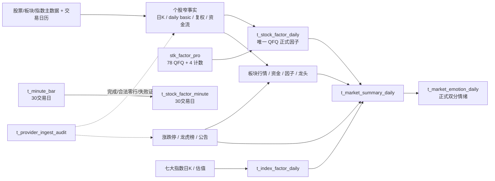

# 每日事实沉淀数据字典

## 结论

日频数据资产只有一套正式契约：窄事实保存不可替代业务事实，类型化派生表服务页面、情绪、策略和回测。股票正式因子表固定为 `t_stock_factor_daily`，一只股票一个交易日一行，价格口径固定为 QFQ；不存在运行时因子版本切换视图。

Tushare `stk_factor_pro` 仍是高级技术指标主来源，但 Provider 返回后直接映射 78 个 QFQ 数值字段和 `updays/downdays/topdays/lowdays` 四个计数列。系统不再保存专业因子 JSON、接口响应正文或物理技术快照。

## 每日执行顺序

| 时间 | 任务 | 写入 |
| --- | --- | --- |
| 15:30 | `daily_close_minute_ingest` | `t_minute_bar`、`t_stock_factor_minute`；按 200 股票分片生成，严格保留最近 30 个交易日。 |
| 18:00 | `daily_close_core_ingest` | 个股日 K、daily basic、复权因子、个股资金流、七大核心指数日 K、接口审计；不计算日频因子。 |
| 19:30 | `daily_close_enrichment_ingest` | 专业技术类型列、涨跌停/停牌、龙虎榜、板块行情/资金、指数估值、市场北向/两融；随后分片生成个股因子，再顺序生成板块因子与龙头、指数因子、市场汇总。 |
| 22:15 | `calculate_market_daily_sentiment` | 正式双分情绪、涨停证据和盘后报告事实；只读本地正式事实与因子。 |
| 次日 08:00 | `daily_close_repair_ingest` | 根据审计和覆盖率只修复实际缺口，并重算受影响日期/股票/板块/市场汇总。 |

## 逻辑关系

这些大表不建立物理外键，统一按 `stock_code + trade_date`、`sector_code + trade_date` 或 `index_code + trade_date` 逻辑关联。批量写入前必须保证主数据已同步。

## 字段单位

- 金额：`*_yuan`，人民币元。
- 股数：`*_shares`，股。
- 百分点：`*_pct`，`3.2` 表示 `3.2%`。
- 比例：`*_ratio`，`0.032` 表示 `3.2%`。
- 分位和评分：`0–100`。
- 大事实表不保存逐行 `metadata.raw`；完整响应不入库。

Provider 入库转换：`daily.amount` 千元乘 1,000；`daily_basic` 万股/万元乘 10,000；个股 `moneyflow` 万元乘 10,000；`moneyflow_ind_ths/moneyflow_cnt_ths` 亿元乘 100,000,000；`moneyflow_hsgt` 百万元乘 1,000,000。指数每日指标本身为元和股，不重复放大。

## 分钟层

### `t_minute_bar`

- 唯一键：`stock_code + trade_date + bar_time + interval + source`。
- 字段：`price`、`avg_price`、`volume_hand`、`volume_share`、`amount_yuan`。
- 来源：MooTDX。按 `trade_date` 分区，最近 30 个交易日之外的分区直接清理。
- `amount_yuan` 不可得时保持空，不根据价格和成交量伪造。

### `t_stock_factor_minute`

- 唯一键：`stock_code + trade_date + bar_time + source`。
- 字段：`vwap`、`return_1m_pct`、`return_5m_pct`、`return_15m_pct`、`ma5/10/20`、`volume_ratio_20m`、`intraday_position_ratio`。
- 只有分钟线存在真实成交额时才计算累计 VWAP。
- 不保存 `features` JSON；算法、窗口和单位在 `t_factor_definition` 登记。

## 个股日频窄事实

### `t_daily_bar`

个股唯一 BFQ 日线源，唯一键 `stock_code + trade_date`。字段包括 OHLC、前收、涨跌额/幅、`volume_hand`、`volume_share`、`amount_yuan`。换手率、估值、事件状态不得复制到本表。

### `t_stock_daily_basic`

唯一键 `stock_code + trade_date`。只保存：

- `turnover_rate_pct`、`turnover_rate_free_pct`、`provider_volume_ratio`。
- `pe/pe_ttm/pb/ps/ps_ttm`、`dividend_yield_pct/dividend_yield_ttm_pct`。
- `total_share_shares/float_share_shares/free_share_shares`。
- `total_market_value_yuan/circulating_market_value_yuan`。

不保存收盘价、涨跌停状态或万元/万股兼容列。

### `t_stock_adjust_factor`

唯一键 `stock_code + trade_date + source`。`adj_factor` 用于本地构造和校验 QFQ/HFQ。BFQ 展示直接读日 K，HFQ 按需计算，不复制进标准因子表。

### `t_stock_fund_flow_daily`

唯一键 `stock_code + trade_date`。保存小/中/大/特大单买卖额和各档净流入，金额统一为元；Provider 比例与本地按成交额归一的比例使用不同名称。不得保存收盘价、涨跌幅或排名。

### `v_stock_daily_fact`

以日 K 为主干左连接 daily basic 和资金流，输出 BFQ 行情、估值流动性、资金流、三块实际来源和更新时间。普通查询可用此视图，策略和回测读取正式因子表。

## `t_stock_factor_daily`：唯一正式个股因子

唯一键为 `stock_code + trade_date`，`price_basis` 恒为 `qfq`，没有 `factor_set_version`。

### Provider 技术列

- QFQ OHLC；MA 5/10/20/30/60/90/250；EMA 5/10/20/30/60/90/250。
- MACD/DIF/DEA、KDJ、RSI6/12/24、BOLL、ATR、BBI、BIAS、CCI、VR、WR、OBV、MFI、ROC、MTM。
- MTMMA、ASI/ASIT、BR/AR、CR、DFMA、DMI、DPO/MADPO、EMV/MAEMV、EXPMA12/50。
- Keltner、MASS/MA-MASS、MAROC、PSY/PSYMA、TAQ、TRIX/TRMA、XSII TD1–TD4。
- `updays/downdays/topdays/lowdays`。

专业字段由 `stk_factor_pro` 直接 Upsert 到类型列，不经过中间 JSON 表。Provider 缺失时只本地回退策略核心：QFQ 价格、MA、EMA、MACD、KDJ、RSI、BOLL 和 ATR；高级指标允许为空。

### 本地可重算列

- `rsi14`；1/3/5/10/20/60/120/250 日收益。
- 日振幅、开盘缺口、收盘位置。
- 5/10/20 日量比与额比；5/20/60 日平均成交额。
- 5/10/20/60 日实际波动率。
- 20/60/120/250 日高低点、距高低点比例和回撤。
- 相对沪深 300 的 5/20/60 日强弱。
- 收益、成交额、换手率和主力资金横截面分位。
- 主力/大单/特大单流入及成交额占比、3/5/10/20 日累计和连续流入天数。

新股不足 N 日时使用上市以来已有交易日，不能因 MA250 缺失阻塞只需要短周期输入的策略。

### 服务列与质量

受控复制换手率、估值、股本、市值和资金列，方便策略单表过滤。数据组状态为：`price_status`、`technical_core_status`、`technical_extended_status`、`valuation_status`、`fund_status`。另保存 `quality_flags TEXT[]`、四类来源、`calculation_revision`、`history_days`、`calculated_at`。

当日复权因子与上一有效因子发生变化时，19:30 组装会用除权前 BFQ、复权因子和已存 QFQ 反算真实缩放比例，仅重锚该股历史价格维度列。收益率、RSI、KDJ 等无量纲列不放大；重复执行时反算比例为 1，不会二次缩放。

每个策略按自己的 `required_inputs` 校验字段和数据组，禁止使用一个全局 ready 状态阻塞所有策略。

## 事件层

| 表 | 唯一键/职责 |
| --- | --- |
| `t_limit_event_daily` | `stock_code + trade_date + event_type`；涨停、跌停、炸板、停复牌。合法零行必须由审计完成状态证明。 |
| `t_lhb_event` | `stock_code + trade_date + reason`；龙虎榜股票事件。 |
| `t_lhb_seat_detail` | `stock_code + trade_date + seat_name + side + source`；龙虎榜席位明细。 |
| `t_announcement` | 公告证据；不得把公告或龙虎榜关联写成已证实的涨停因果。 |
| `t_market_limit_up_evidence_daily` | 涨停板数、题材、龙虎榜、公告等关联证据。 |

## 板块层

### 事实

- `t_sector_bar`：同花顺概念/行业板块日 K，唯一键 `sector_code + trade_date`。每日按 `trade_date` 一次请求全量 `ths_daily`。
- `t_sector_fund_flow_daily`：板块资金流，唯一键同上。两个 THS 资金接口的官方金额单位是亿元，入库统一乘 100,000,000 转元。

### `t_sector_factor_daily`

保存板块 MA、收益、波动和回撤；成分覆盖、涨跌平、均值/中位涨幅、站上 MA 比例、创新高低；涨跌停/炸板/一字/换手板；资金流及累计、连续流入和排名；热度、持续性与龙头强度。`features/tags` JSON 不再作为正式字段。

### `t_sector_leader_daily`

唯一键 `sector_code + trade_date + leader_rank`，每板块每天最多 5 只龙头，保存股票、涨幅、成交额、板数和龙头评分。多龙头不再嵌入板块因子 JSON。

## 指数层

- `t_index_bar`：七大核心指数日 K；当日优先 TickFlow，缺失才回退 Tushare，历史使用 Tushare。
- `t_index_daily_basic`：可获得的指数估值、股本、市值和换手，官方只覆盖部分指数时允许缺失。
- `t_index_factor_daily`：七大指数 MA5/10/20/30/60/120/250、EMA、1/5/10/20/60 日收益、振幅、波动、高低点、回撤、量额比、趋势状态和估值。

指数 canonical 表一律使用无交易所后缀的六位代码：`000001/399001/399006/000300/000905/000852/000016`。仅 Provider 请求边界使用 `000001.SH/399001.SZ` 等带后缀 symbol；指数因子、沪深 300 相对强弱、市场汇总与 `79b` 门禁均按 canonical 代码读取。

行情因子要求七只完整；估值缺失不阻塞行情与报告。

## 市场层

### `t_market_summary_daily`

每个交易日只聚合一行，供情绪、盘后报告和策略环境门控复用：

- eligible、日 K、daily basic、资金流、因子覆盖数。
- 涨跌平、平均/中位涨幅、±1/3/5/7% 分布。
- 总成交额、5/20 日量能比、平均/中位换手和平均 20 日实际波动率。
- 全市场主力净流入及强度。
- 站上 MA5/20/60/250 比例，20/60/250 日创新高低。
- 涨停、跌停、炸板、一字板、换手板、最高连板和晋级率。
- 七大指数完成数、上涨数、平均 1 日收益和平均振幅。
- 北向资金和两融的最新实际披露日。

### 非阻塞辅助

- `t_market_north_flow_daily`：市场级互联互通资金，单位元。
- `t_margin_summary_daily`：交易所两融汇总，使用实际披露日；不得用系统当天伪装为当日数据。

个股北向持仓不再调用、不展示、不参与评分。`daily_info` 交易所统计不再作为正式资产，市场宽度和成交等统一由本地事实聚合。

## 情绪与审计

### `t_market_emotion_model` / `t_market_emotion_daily`

只保留正式双分模型与不可变参数审计。每日结果包含短线接力分、大盘风险偏好分、主阶段、辅助状态、指标明细、覆盖、参数快照与阶段证据。模型版本属于实验可复现审计，不代表存在多套物理行情或因子资产。

### `t_provider_ingest_audit`

永久保存 Provider、能力、日期、脱敏参数摘要、请求字段、返回/入库行数、Payload SHA256、状态、错误和 schema 修订。状态为 `captured/complete_zero/deferred/failed`。响应正文、Token 和逐行 Raw 不入库。

### `t_factor_definition`

登记因子名称、分组、频率、类型列、公式、单位、窗口、Provider 字段和是否可重算。扩展因子必须先登记契约，再增加类型列；不得重新引入任意 JSON 因子集合。

## 已退出正式契约的资产

旧股票因子、因子激活视图、专业因子 JSON 档案、技术快照、旧单分情绪、旧板块热度、个股北向持仓、市场 `daily_info`、筹码日表和 Provider Raw 正文均由最终清理脚本删除。应用、调度、数据中心和页面不得再读取这些资产。

## 迁移与上线门禁

执行顺序固定为：`77 prepare → 78 backfill → 停 worker → 79 cutover → 部署正式代码 → 三类有界历史因子回填 → 79b resume → 观察 7 日并备份 → 80 cleanup`。

- `78` 按 20 个交易日独立提交，可中断续跑；旧专业因子 JSON 的四个计数字段虽以 `0.0/13.0` 形式存储，迁移时会先转 `numeric` 再转 `integer`。单窗口报错会整个回滚，替换修正脚本后直接重跑，不需要清理影子表。
- `79` 原子切表后保持每日任务停用，避免旧代码写正式新表。
- `79b` 要求最新日个股覆盖不低于 98%、七大指数因子完整、市场汇总 ready、板块因子覆盖通过，才恢复原启用任务。
- `80` 不可逆；必须通过 7 日观察、策略差异解释、API/任务耗时验收并确认备份后执行。

## 源码与迁移依据

- `python-back/app/modules/market_data/models.py`
- `python-back/app/modules/market_data/stock_factor_contract.py`
- `python-back/app/modules/market_data/close_ingest.py`
- `python-back/app/modules/market_data/repository.py`
- `python-back/app/modules/indicator_engine/repository.py`
- `docs/sql/77-daily-assets-final-prepare.sql`
- `docs/sql/78-daily-assets-final-backfill.sql`
- `docs/sql/79-daily-assets-final-cutover.sql`
- `docs/sql/79b-daily-assets-final-resume.sql`
- `docs/sql/80-daily-assets-final-cleanup.sql`
