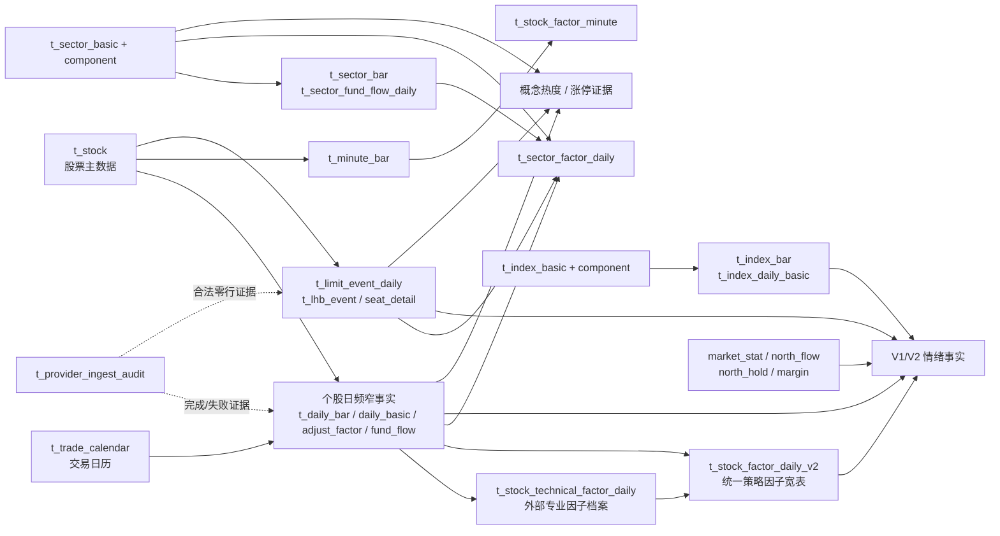

# 每日事实沉淀数据字典

## 范围与结论

本文描述当前生产数据库中仍启用的每日流水线、实际写入表、字段口径和逻辑关联。核验依据为 2026-08-15 的调度定义、SQLAlchemy 模型、Repository 写入路径和生产库最新数据。

当前每日链路共涉及 **25 张表**：

- 17 张原始或 canonical 事实表。
- 3 张派生因子表（分钟、个股日频、板块日频）。
- 1 张接口级审计表。
- 4 张盘后市场洞察派生表。

分钟事实和分钟因子只保留最近 30 个交易日；其余日频事实、事件、专业因子、标准因子和报告事实长期保留。所有金额字段必须以本表说明为准，不能仅凭字段名推断 Provider 原始单位。

## 当前每日执行顺序

| 时间 | 任务 | 主要写入 | 说明 |
| --- | --- | --- | --- |
| 15:30 | `daily_close_minute_ingest` | `t_minute_bar`、`t_stock_factor_minute` | MooTDX 分钟线；10 个拉取 worker；分钟因子按最多 200 股一批计算；两表保留最近 30 个交易日。 |
| 18:00 | `daily_close_core_ingest` | `t_daily_bar`、`t_stock_daily_basic`、`t_stock_adjust_factor`、`t_stock_fund_flow_daily`、`t_index_bar`、`t_provider_ingest_audit` | 个股四类核心事实并行沉淀；七个核心指数当日优先 TickFlow，缺失才回退 Tushare。V2 启用后不再生成 V1 日频因子。 |
| 19:30 | `daily_close_enrichment_ingest` | 涨跌停/停复牌、板块日线、专业因子、龙虎榜、指数指标、市场统计、北向/两融、板块资金流、V2 个股因子、板块因子、审计 | 当前数据库实际 cron 是 19:30，不是旧文档中的 21:30。各数据块并行，外部延迟项允许 `deferred`。 |
| 22:15 | `calculate_market_daily_sentiment` | `t_market_sentiment_daily`、`t_market_emotion_daily`、`t_market_sector_heat_daily`、`t_market_limit_up_evidence_daily` | 只读已经沉淀的数据库事实，生成 V1 兼容情绪、V2 双分周期、概念热度和涨停关联证据；不调用 Provider 或 LLM。 |
| 次日 08:00 | `daily_close_repair_ingest` | 仅补前述实际缺失的事实、因子与审计 | 检查最近 3 个已有个股日线的交易日；不补历史分钟线；只重算受影响范围。 |

`refresh_data_asset_health` 每 4 小时刷新一次 Redis 健康快照，不写业务事实表，因而不计入上述 25 张表。

## 总体关联关系

数据库没有为这些大事实表建立物理外键，以下均为业务逻辑关联。这样可以降低海量批量 Upsert 的约束成本，但删除或改名主数据时必须由服务保证完整性。

所有个股表以 `stock_code` 逻辑关联 `t_stock.stock_code`，所有交易日以 `trade_date` 逻辑关联 `t_trade_calendar.trade_date`；板块和指数分别以 `sector_code`、`index_code` 关联对应主数据。

## 15:30 分钟层

### `t_minute_bar`：个股分钟线

生产任务：`daily_close_minute_ingest`。数据源：MooTDX。保留：最近 30 个交易日。

业务唯一键：`stock_code + trade_date + bar_time + interval + source`。表按 `trade_date` 分区，物理主键为 `id + trade_date`。

| 字段 | 描述 |
| --- | --- |
| `id`、`created_at` | 分区内流水 ID、写入时间。 |
| `stock_code`、`trade_date`、`bar_time` | 股票代码、所属交易日、带时区分钟时间。 |
| `interval`、`source` | 当前主要为 `1m`、MooTDX 来源标识。 |
| `price`、`avg_price` | 分钟收盘/最新价和 Provider 分钟均价。当前表没有独立 OHLC 四列。 |
| `volume_hand`、`volume_share` | 成交手数和折算股数。 |
| `amount_yuan` | 成交金额，人民币元。 |
| `metadata` | 小型来源与映射信息；Repository 会移除新写入行的 `metadata.raw`。 |

关联：同一股票和分钟时间连接 `t_stock_factor_minute`；日内最后一分钟可与 `t_daily_bar`、动态技术快照组合查询。

### `t_stock_factor_minute`：分钟因子

生产任务：`daily_close_minute_ingest`。输入：`t_minute_bar`。保留：最近 30 个交易日。

业务唯一键：`stock_code + trade_date + bar_time + source`。

| 字段 | 描述 |
| --- | --- |
| `id`、`created_at` | 分区流水 ID、生成时间。 |
| `stock_code`、`trade_date`、`bar_time`、`source` | 股票、日期、分钟和算法来源。 |
| `vwap` | 截至该分钟的日内成交量加权平均价。 |
| `minute_return` | 分钟收益率。 |
| `volume_spike_ratio` | 当前分钟相对滚动窗口的量能放大比例。 |
| `intraday_strength` | 价格在当日运行区间中的强弱/位置指标。 |
| `features` | 现存扩展 JSON。收敛目标是仅保留必要小型特征；物理列目前尚未删除。 |

关联：按 `stock_code + trade_date + bar_time` 连接分钟线。`source` 可能与分钟线来源不同，连接时不应强制来源相等。

## 18:00 个股与指数核心事实

### `t_daily_bar`：个股 BFQ 日 K

生产任务：`daily_close_core_ingest`；缺口由 `daily_close_repair_ingest` 修复。数据源：Tushare `daily`。长期保留。

业务唯一键：`stock_code + trade_date`。这是个股**不复权实际行情的唯一权威源**。

| 字段 | 描述 |
| --- | --- |
| `id`、`created_at`、`updated_at` | 流水 ID、首次与最后写入时间。 |
| `stock_code`、`trade_date`、`source`、`adjust_mode` | 股票、交易日、来源；当前日常事实为 BFQ/`none`。 |
| `open_price`、`high_price`、`low_price`、`close_price` | 开高低收。 |
| `pre_close_price`、`change_amount`、`change_pct` | 前收、涨跌额、涨跌幅百分数。 |
| `volume_hand`、`volume_share`、`amount_yuan` | 成交手、成交股、成交金额元；Tushare 原始千元已归一为元。 |
| `turnover_rate` | 兼容字段；权威换手率应优先读取 `t_stock_daily_basic.turnover_rate`。 |
| `metadata` | 来源、接口、单位转换和 schema 版本，不保留新请求的逐行 Raw 副本。 |

关联：是 `v_stock_daily_fact`、V2 标准因子、情绪、概念热度、事件解释和策略回测的价格主表。

### `t_stock_daily_basic`：每日估值与流动性

生产任务：`daily_close_core_ingest`。数据源：Tushare `daily_basic`。长期保留。

业务唯一键：`stock_code + trade_date`。

| 字段 | 描述 |
| --- | --- |
| `stock_code`、`trade_date`、`source` | 业务维度与来源。 |
| `turnover_rate`、`turnover_rate_f` | 总股本口径与自由流通股本口径换手率。 |
| `volume_ratio` | Provider 当日量比；在统一视图中命名为 `provider_volume_ratio`，不要与本地 `volume_ratio_5d` 混用。 |
| `pe`、`pe_ttm`、`pb`、`ps`、`ps_ttm` | 静态/TTM 市盈率、市净率、市销率。 |
| `dv_ratio`、`dv_ttm` | 股息率和 TTM 股息率。 |
| `total_share`、`float_share`、`free_share` | 总股本、流通股本、自由流通股本；当前保留 Tushare 字段原始单位。 |
| `total_mv`、`circ_mv` | 总市值和流通市值；当前保留 Tushare 万元口径。 |
| `close_price`、`limit_status` | 物理兼容列；V2 日常请求不再依赖，价格与事件分别以 `t_daily_bar`、`t_limit_event_daily` 为准。 |
| `metadata`、审计时间列 | 轻量来源/字段版本和写入时间。 |

关联：与日 K 一对零或一；V2 因子受控复制换手率和市值，策略不应直接把这张表与 BFQ/QFQ 技术价格混用。

### `t_stock_adjust_factor`：复权因子

生产任务：`daily_close_core_ingest`。数据源：Tushare `adj_factor`。长期保留。

业务唯一键：`stock_code + trade_date + source`。

| 字段 | 描述 |
| --- | --- |
| `stock_code`、`trade_date`、`source` | 股票、日期、来源。 |
| `adj_factor` | 当日复权因子，用于从 BFQ 日 K 构造/校验 QFQ、HFQ 序列。 |
| `metadata`、`created_at` | 轻量来源信息与写入时间。 |

关联：V2 组装会读取一段复权历史，将 BFQ 价格转换为同一 QFQ 基准；不能单独将某日因子直接当作价格乘数而忽略基准日。

### `t_stock_fund_flow_daily`：个股资金流

生产任务：`daily_close_core_ingest`。数据源：Tushare `moneyflow`。长期保留。

业务唯一键：`stock_code + trade_date`。金额统一为人民币元。

| 字段 | 描述 |
| --- | --- |
| `stock_code`、`trade_date`、`source` | 业务维度与来源。 |
| `small_buy_amount`、`small_sell_amount` | 小单买入/卖出额。 |
| `medium_buy_amount`、`medium_sell_amount` | 中单买入/卖出额。 |
| `large_buy_amount`、`large_sell_amount` | 大单买入/卖出额。 |
| `super_large_buy_amount`、`super_large_sell_amount` | 特大单买入/卖出额。 |
| `main_net_inflow`、`big_order_net_inflow`、`super_large_net_inflow`、`medium_net_inflow`、`small_net_inflow` | 各档净流入派生值。 |
| `main_net_ratio`、`big_order_net_ratio` | Provider/兼容比例字段；本地统一因子另有按成交额计算的标准化比例。 |
| `close_price`、`change_pct`、`rank` | 物理兼容列；当前 Tushare moneyflow 写入不再把它们作为权威事实。 |
| `metadata`、审计时间列 | 轻量来源/单位转换和写入时间。 |

关联：与日 K 一对零或一；V2 因子由此生成 3/5/10 日累计流入、连续流入天数和横截面分位；板块因子也按成分股汇总本表。

### `t_index_bar`：七大核心指数日 K

生产任务：`daily_close_core_ingest`。当日优先 TickFlow `klines`，缺失指数回退 Tushare `index_daily`；历史回填仍使用 Tushare。长期保留。

业务唯一键：`index_code + trade_date`。

| 字段 | 描述 |
| --- | --- |
| `index_code`、`trade_date`、`source` | 指数、交易日和实际成功来源。 |
| `open_price`、`high_price`、`low_price`、`close_price` | 指数开高低收。 |
| `change_pct`、`volume`、`amount_yuan` | 涨跌幅、成交量、成交额元。Tushare 原始成交额千元会归一为元。 |
| `metadata`、`created_at` | 轻量来源与写入时间。 |

关联：逻辑父表为 `t_index_basic`；V2 大盘风险偏好使用限定的七个核心指数趋势和振幅，不允许其他历史指数混入口径。

## 19:30 晚间增强事实

### `t_limit_event_daily`：涨跌停、炸板与停复牌事件

生产任务：`daily_close_enrichment_ingest`；数据源：Tushare `limit_list_d`、`suspend_d`。长期保留。

业务唯一键：`stock_code + trade_date + event_type`。

| 字段 | 描述 |
| --- | --- |
| `event_type` | `limit_up`、`limit_down`、`limit_break`、`suspend`。 |
| `stock_code`、`trade_date`、`source` | 股票、日期、来源。 |
| `close_price`、`limit_price` | 收盘价与涨/跌停价格。 |
| `first_time`、`last_time` | 首次与最后封板时间。 |
| `open_count` | 开板次数；结合开盘价和涨停价识别一字板/换手板。 |
| `turnover_amount` | 事件接口返回的成交额口径。 |
| `metadata`、`created_at` | 轻量事件补充和写入时间。 |

关联：情绪、连板梯队、概念热度、涨停证据和板块因子共同读取。某日没有记录不等于“零事件”，必须同时检查 `t_provider_ingest_audit` 的成功/合法零行完成证据。

### `t_sector_bar`：同花顺板块日 K

生产任务：`daily_close_enrichment_ingest`；数据源：Tushare `ths_daily`。长期保留。

业务唯一键：`sector_code + trade_date`。

| 字段 | 描述 |
| --- | --- |
| `sector_code`、`trade_date`、`source` | canonical 板块代码、交易日、来源。 |
| `open_price`、`high_price`、`low_price`、`close_price`、`pre_close_price` | 板块日 K 和前收。 |
| `change_amount`、`change_pct`、`turnover_rate` | 涨跌额、涨跌幅、换手率。 |
| `volume`、`amount_yuan` | 成交量和归一为元的成交额。 |
| `metadata`、`created_at` | 映射、单位转换与写入时间。旧行仍可能包含 `metadata.raw`。 |

关联：逻辑父表为 `t_sector_basic`。板块因子读取本表，但盘后概念热度刻意不依赖本表，以避免 `ths_daily` 延迟阻塞报告。

### `t_stock_technical_factor_daily`：Tushare 专业技术因子档案

生产任务：`daily_close_enrichment_ingest`；数据源：Tushare `stk_factor_pro`。全量长期保留一次。

业务唯一键：`stock_code + trade_date`。

| 字段 | 描述 |
| --- | --- |
| `stock_code`、`trade_date`、`source` | 股票、日期和 Provider 接口。 |
| `factors` | 完整专业因子 JSON。按 BFQ/QFQ/HFQ 保存 OHLC、MA/EMA、MACD、KDJ、RSI、BOLL、ATR、CCI、VR、WR、BIAS、OBV、MFI、ROC、MTM 及 Provider 扩展字段。 |
| `metadata`、审计时间列 | 轻量接口/schema 信息，不再重复保存完整 envelope。 |

关联：这是外部派生因子档案，不是页面/策略直接查询表；V2 标准因子优先抽取其 QFQ 字段，缺失时才使用日 K 与复权因子本地回退。

### `t_lhb_event`：龙虎榜股票事件

生产任务：`daily_close_enrichment_ingest`；数据源：Tushare `top_list`。长期保留。

业务唯一键：`stock_code + trade_date + reason`。金额统一为人民币元。

| 字段 | 描述 |
| --- | --- |
| `stock_code`、`stock_name`、`trade_date`、`source` | 股票、名称、日期、来源。 |
| `reason` | 上榜原因/条件，不应被解释成涨停原因。 |
| `close_price`、`change_pct`、`turnover_amount` | 当日行情摘要和成交额。 |
| `buy_amount`、`sell_amount`、`net_buy_amount` | 龙虎榜买入、卖出和净买入额。 |
| `metadata`、审计时间列 | 轻量补充和写入时间。 |

关联：股票/date 可连接日 K、涨停事件和席位明细；涨停关联证据只把它作为交易异常证据。

### `t_lhb_seat_detail`：龙虎榜席位明细

生产任务：`daily_close_enrichment_ingest`；数据源：Tushare `top_inst`。长期保留。

业务唯一键：`stock_code + trade_date + seat_name + side + source`。

| 字段 | 描述 |
| --- | --- |
| `stock_code`、`trade_date`、`source` | 股票、日期、来源。 |
| `side`、`seat_name`、`rank` | 买/卖侧、席位名称及排序。 |
| `buy_amount`、`sell_amount`、`net_amount` | 席位买、卖、净额。 |
| `metadata`、`created_at` | 轻量补充和写入时间。 |

关联：一条 `t_lhb_event` 可能对应多条席位记录。当前没有 event ID 外键，使用股票和日期建立事件上下文。

### `t_index_daily_basic`：指数每日估值指标

生产任务：`daily_close_enrichment_ingest`；数据源：Tushare `index_dailybasic`。长期保留。

业务唯一键：`index_code + trade_date`。

| 字段 | 描述 |
| --- | --- |
| `index_code`、`trade_date`、`source` | 指数、交易日、来源。 |
| `total_mv`、`float_mv` | 总市值、流通市值，保留 Provider 原始单位。 |
| `total_share`、`float_share`、`free_share` | 总股本、流通股本、自由流通股本，保留 Provider 原始单位。 |
| `turnover_rate`、`turnover_rate_f` | 两种股本口径换手率。 |
| `pe`、`pe_ttm`、`pb` | 指数估值指标。 |
| `metadata`、审计时间列 | 原始单位声明、schema 与写入时间。 |

关联：与 `t_index_bar` 以指数和日期一对零或一关联；当前情绪核心分数主要使用指数日 K，本表属于增强研究事实。

### `t_market_daily_stat`：交易所市场统计

生产任务：`daily_close_enrichment_ingest`；数据源：Tushare `daily_info`。长期保留。

业务唯一键：`trade_date + ts_code + exchange`。

| 字段 | 描述 |
| --- | --- |
| `trade_date`、`ts_code`、`ts_name`、`exchange`、`source` | 日期、统计项代码/名称、交易所与来源。 |
| `company_count` | 公司数量。 |
| `total_share`、`float_share`、`total_mv`、`float_mv` | 股本和市值汇总，保留 Provider 原始单位。 |
| `amount`、`volume`、`transaction_count` | 成交额、成交量、成交笔数，保留 Provider 原始单位。 |
| `pe`、`turnover_rate` | 市场平均/汇总估值和换手。 |
| `metadata`、审计时间列 | 明确记录未归一的 Provider 单位和写入时间。 |

关联：这是交易所/市场层事实，不连接单只股票；当前作为报告和研究补充，不是个股策略主输入。

### `t_market_north_flow_daily`：市场级北向/南向资金流

生产任务：`daily_close_enrichment_ingest`；数据源：Tushare `moneyflow_hsgt`。长期保留。

业务唯一键：`trade_date + source`。

| 字段 | 描述 |
| --- | --- |
| `trade_date`、`source` | 日期和来源。 |
| `hgt`、`sgt`、`north_money` | 沪股通、深股通和北向合计。 |
| `ggt_ss`、`ggt_sz`、`south_money` | 港股通沪、港股通深和南向合计。 |
| `metadata`、审计时间列 | Provider 原始单位说明和写入时间。 |

关联：V2 情绪资金活跃度直接使用 `north_money`；模型页面必须同时展示来源和单位，不能与个股资金流元口径直接相加。

### `t_stock_north_hold_daily`：个股北向持仓（延迟确认）

生产任务：`daily_close_enrichment_ingest` 的 delayed confirmations；数据源：Tushare `hk_hold`。按最近实际披露日幂等补数，长期保留。

业务唯一键：`stock_code + trade_date + exchange`。

| 字段 | 描述 |
| --- | --- |
| `stock_code`、`stock_name`、`trade_date`、`exchange`、`source` | 股票、名称、实际披露日、市场和来源。 |
| `hold_volume`、`hold_ratio`、`hold_market_value` | 持股数量、持股比例、持股市值。 |
| `hold_volume_change` | 持股数量变化。 |
| `metadata`、审计时间列 | 轻量来源、披露和写入时间。 |

关联：只在 V2 情绪页面“辅助确认”显示，`scoring_included=false`，不阻塞当日评分。当前生产表尚无数据，见文末现状。

### `t_margin_summary_daily`：交易所两融汇总（延迟确认）

生产任务：`daily_close_enrichment_ingest` 的 delayed confirmations；数据源：Tushare `margin`。按实际披露日补数，长期保留。

业务唯一键：`trade_date + exchange + source`。

| 字段 | 描述 |
| --- | --- |
| `trade_date`、`exchange`、`source` | 实际披露日、交易所、来源。 |
| `rzye`、`rz_mre`、`rzche` | 融资余额、融资买入额、融资偿还额。 |
| `rqye`、`rq_mcl` | 融券余额、融券卖出量。 |
| `rzrqye` | 融资融券余额合计。 |
| `metadata`、`created_at` | Provider 单位/来源和写入时间。 |

关联：只作 V2 情绪辅助确认，不参与当日核心分数；不应强行用系统日期连接，必须显示实际披露日。

### `t_sector_fund_flow_daily`：板块资金流

生产任务：`daily_close_enrichment_ingest`；数据源：Tushare `moneyflow_ind_ths`、`moneyflow_cnt_ths`。长期保留。

业务唯一键：`sector_code + trade_date`。金额字段已归一为人民币元。

| 字段 | 描述 |
| --- | --- |
| `sector_code`、`sector_name`、`sector_type`、`trade_date`、`source` | 板块、名称、行业/概念类型、日期和来源。 |
| `main_net_inflow`、`net_buy_amount`、`net_sell_amount` | 主力净流入、净买额、净卖额。 |
| `main_net_ratio`、`change_pct`、`close_price` | 主力净流比例、板块涨幅和收盘值。 |
| `company_num`、`lead_stock`、`lead_stock_change_pct` | 公司数、领涨股和领涨股涨幅。 |
| `rank` | Provider 排名。 |
| `metadata`、审计时间列 | 映射、单位和写入时间。 |

关联：逻辑父表为 `t_sector_basic`；与板块日 K、成分股日 K/资金流、涨停事件共同生成板块因子。

## 19:30 派生因子

### `t_stock_factor_daily_v2`：统一 QFQ 标准日频因子宽表

生产任务：`daily_close_enrichment_ingest`；缺口由 `daily_close_repair_ingest` 定向重算。长期保留。当前激活版本为 `stock_daily_v2`。

业务唯一键：`stock_code + trade_date + factor_set_version`。消费者应优先读取 `v_stock_factor_daily_active_basis`，而不是硬编码表名。

| 字段组 | 字段与描述 |
| --- | --- |
| 身份与质量 | `stock_code`、`trade_date`、`factor_set_version`、`price_basis=qfq`、`factor_status`、`history_days`、`missing_factors`。只有 `ready` 行可进入策略。 |
| 来源追踪 | `technical_source`、`local_source`、`fund_source`、`source_map`。记录专业 QFQ、本地回退和资金来源。 |
| QFQ 价格 | `open/high/low/close/pre_close_qfq`，保证与技术因子同口径比较。 |
| 均线与 EMA | `ma5/10/20/30/60/90/250`，`ema5/10/20/30/60`。不足 N 个交易日时用上市以来已有样本计算。 |
| 趋势/摆动指标 | `macd/dif/dea`、`kdj_k/d/j`、`rsi6/12/14/24`、`boll_upper/mid/lower`、`atr`、`cci`、`vr`、`wr`、`bias`、`obv`、`mfi`、`roc`、`mtm`。 |
| 本地价格派生 | `return_1/3/5/10/20d`、`amplitude`、`volume_ratio_5d`、`amount_ratio_5d`、`volatility_20d`、`close_position`、`high/low_20d`、`high/low_60d`、`drawdown_20/60d`。 |
| 流动性/市值副本 | `turnover_rate`、`circ_mv`、`total_mv`，供策略单表过滤；权威源仍为 daily_basic。 |
| 资金因子 | 主力/大单/特大单净流入和成交额标准化比例、`net_inflow_3/5/10d`、连续流入天数、横截面分位。 |
| 时间列 | `created_at`、`updated_at`。 |

关联：输入 `t_daily_bar + t_stock_adjust_factor + t_stock_daily_basic + t_stock_fund_flow_daily + t_stock_technical_factor_daily`；下游为策略、回测、实时确认、V2 情绪和个股因子页面。

### `t_sector_factor_daily`：板块日频因子

生产任务：`daily_close_enrichment_ingest`；缺口由修复任务定向重算。长期保留。

业务唯一键：`sector_code + trade_date`。

| 字段 | 描述 |
| --- | --- |
| `sector_code`、`sector_name`、`sector_type`、`trade_date`、`source` | 板块维度、日期和算法来源。 |
| `fund_strength` | 板块资金强度。 |
| `net_inflow_3d`、`net_inflow_5d`、`net_inflow_10d` | 板块滚动净流入。 |
| `continuous_inflow_days` | 连续资金流入交易日数。 |
| `rising_stock_count`、`limit_up_stock_count` | 成分股上涨/涨停家数。 |
| `average_change_pct` | 成分股平均涨跌幅。 |
| `volatility_20d` | 板块 20 日波动率。 |
| `tags`、`features` | 算法标签和可审计扩展特征。 |
| 审计时间列 | 首次和最后生成时间。 |

关联：通过 `t_sector_component` 聚合成分股 `t_daily_bar`、`t_stock_fund_flow_daily`、`t_limit_event_daily`，并结合 `t_sector_bar`、`t_sector_fund_flow_daily`。

## 接口级完成审计

### `t_provider_ingest_audit`：轻量沉淀审计

生产任务：18:00 核心、19:30 增强和次日修复任务。长期保留，不保存完整响应 JSON。

业务唯一键：`trace_id`。

| 字段 | 描述 |
| --- | --- |
| `trace_id`、`provider_code`、`capability`、`trade_date` | 一次接口沉淀追踪、Provider、能力和目标交易日。 |
| `request_params`、`requested_fields` | 脱敏参数摘要和请求字段列表；Token 等敏感值不得进入。 |
| `response_row_count`、`normalized_row_count` | Provider 返回行数和 canonical 映射/入库行数。 |
| `payload_sha256` | 响应内容哈希，用于重复与变更核验，不保存 payload 本身。 |
| `normalized_table`、`schema_version` | 目标表和映射 schema 版本。 |
| `status` | `captured`、`complete_zero`、`deferred`、`failed`。事件零行是否完整必须看此字段。 |
| `error_code`、`error_message` | 权限、空响应、限频、传输或映射错误。 |
| `started_at`、`finished_at`、`created_at` | 请求和审计时间。 |

关联：通过 `capability + trade_date + normalized_table` 为所有事实提供完成证据；它不是逐行外键，也不能替代业务事实。

## 22:15 盘后市场洞察

### `t_market_sentiment_daily`：V1 兼容情绪

业务唯一键：`trade_date + universe_code + calculation_version`。

| 字段 | 描述 |
| --- | --- |
| `trade_date`、`universe_code`、`calculation_version`、`status` | 日期、沪深 active 非 ST 范围、版本和 ready/pending 状态。 |
| `sentiment_score`、`stage_code` | 0–100 规则情绪分和 V1 阶段。 |
| `components`、`metrics` | 分项得分/权重/公式和原始市场指标。 |
| `coverage`、`source_facts` | 日线覆盖、事件完成证据和输入表快照。 |
| 时间列 | 计算、创建和更新时间。 |

关联：输入日 K、涨跌停事件、交易日历和审计完成标记。V2 已启用但 V1 仍由同一每日任务继续生成，作为兼容展示和对照。

### `t_market_emotion_daily`：V2 双分情绪与周期

业务唯一键：`trade_date + model_code`；`model_code` 逻辑关联 `t_market_emotion_model.model_code`。

| 字段 | 描述 |
| --- | --- |
| `trade_date`、`model_code`、`status` | 日期、不可变模型版本和 ready/degraded/pending 状态。 |
| `short_term_score` | 短线接力情绪分。 |
| `market_risk_on_score` | 大盘风险偏好分。 |
| `primary_stage_code`、`auxiliary_state_code` | 冰点/修复/活跃/高潮/退潮主阶段和辅助状态。 |
| `metrics`、`scorecards` | 每项绝对值、分位、得分、权重、贡献、方向和公式。 |
| `stage_evidence` | 阶段命中的数值证据。 |
| `coverage`、`parameter_snapshot` | 数据覆盖和当时模型参数快照，保证历史可重现。 |
| `external_confirmations` | 北向持仓、两融等延迟确认及实际披露日，不参与核心评分。 |
| 时间列 | 计算、创建和更新时间。 |

关联：输入日 K、事件、激活 V2 因子、七大指数、市场北向流和历史概念热度；不调用 LLM。

### `t_market_sector_heat_daily`：概念题材热度

业务唯一键：`trade_date + sector_code + calculation_version`。

| 字段 | 描述 |
| --- | --- |
| `trade_date`、`sector_code`、`sector_name`、`calculation_version`、`status` | 日期、概念板块、版本和状态。 |
| `heat_score`、`heat_rank` | 当日概念横截面 0–100 热度与排名。 |
| `metrics`、`components` | 平均涨幅、上涨扩散、涨停密度、主力净流入及分项贡献。 |
| `leaders` | 热度头部概念的龙头股票快照。 |
| `coverage`、`source_facts` | 成分股覆盖和事实来源。 |
| 时间列 | 生成和更新时间。 |

关联：通过 `t_sector_component` 直接聚合 `t_daily_bar + t_stock_fund_flow_daily + t_limit_event_daily`；**不依赖 `t_sector_bar`**。

### `t_market_limit_up_evidence_daily`：涨停关联证据

业务唯一键：`trade_date + stock_code + calculation_version`。

| 字段 | 描述 |
| --- | --- |
| `trade_date`、`stock_code`、`stock_name`、`calculation_version`、`status` | 日期、涨停股票、版本和状态。 |
| `board_count` | 连续涨停板数。 |
| `market_snapshot` | 当日价格、事件和资金摘要。 |
| `sector_context` | 所属热点概念和板块上下文。 |
| `evidence` | 龙虎榜、已沉淀公告等关联证据；不代表系统已证明涨停因果。 |
| `coverage`、`source_facts` | 证据覆盖和输入事实。 |
| 时间列 | 生成和更新时间。 |

关联：输入涨停事件、日 K、个股资金流、概念主数据/成分、龙虎榜和已有 `t_announcement`。

## 统一读取视图

### `v_stock_daily_fact`

按 `stock_code + trade_date` 左连接：

- `t_daily_bar`：BFQ 行情主干。
- `t_stock_daily_basic`：估值、换手、股本、市值。
- `t_stock_fund_flow_daily`：各档资金流。

视图同时输出三块来源和更新时间。它明确区分 `provider_volume_ratio` 与本地 `volume_ratio_5d`、Provider 主力比例与按成交额计算的标准比例，避免同名异义。

### `v_stock_factor_daily_active_basis`

根据 `t_factor_set_version` 当前 active 版本统一返回日频因子：V2 返回 QFQ OHLC 和 QFQ 技术因子，V1 回滚时才返回 BFQ 兼容口径。策略、情绪、回测和实时技术确认应读取此视图。

## 不属于当前每日事实沉淀的表

| 表/能力 | 当前定位 |
| --- | --- |
| `t_stock_factor_daily` | V1 个股日频因子已归档，只保留回滚/历史对照；V2 激活后每日核心任务跳过 V1 写入。 |
| `t_technical_indicator_snapshot` | 已停止持久化；API 从激活标准因子、日 K 和最后分钟因子动态生成兼容结构。 |
| `t_index_factor_daily` | 仅历史指数因子回填使用，当前每日四级任务不写。 |
| `t_stock_chip_perf_daily` | 历史/实验筹码摘要，不再每日全市场批量沉淀。 |
| `t_margin_detail_daily` | 个股两融明细不在当前每日流水线，当前只补交易所汇总。 |
| `t_quote_snapshot`、`t_tick_trade` | TickFlow 实时底座主要放 Redis/内存，仅在策略触发等审计场景选择性落库，不属于全市场日终事实。 |
| `t_provider_raw_record` | Legacy Raw，只读保留旧响应；新每日请求写 `t_provider_ingest_audit`，不再保存完整 payload。 |
| 股票/板块/指数/交易日历主表 | 是每日事实的逻辑父数据，但由每周或主数据任务维护，不是每日事实。 |

## 当前生产数据快照与异常

以下是 2026-08-15 核验到的最新生产事实，最近交易日为 2026-08-14：

| 表 | 最新日期 | 最新日行数 | 判断 |
| --- | --- | ---: | --- |
| `t_minute_bar` | 2026-08-14 | 1,249,920 | 已覆盖全市场约 240 分钟。 |
| `t_stock_factor_minute` | 2026-08-14 | 1,249,920 | 与分钟线数量一致。 |
| `t_daily_bar` | 2026-08-14 | 5,205 | 正常。 |
| `t_stock_daily_basic` | 2026-08-14 | 5,205 | 正常。 |
| `t_stock_adjust_factor` | 2026-08-14 | 5,208 | 正常，范围比日线略宽。 |
| `t_stock_fund_flow_daily` | 2026-08-14 | 5,205 | 正常。 |
| `t_index_bar` | 2026-08-14 | 7 | 七大核心指数完整。 |
| `t_limit_event_daily` | 2026-08-14 | 93 | 涨停 62、跌停 9、炸板 19、停牌 3。 |
| `t_sector_bar` | **2026-07-29** | 933 | **已明显停更，需要排查 `ths_daily` 权限/发布时间与增强块状态。** |
| `t_stock_technical_factor_daily` | 2026-08-14 | 5,205 | 正常。 |
| `t_lhb_event` / `t_lhb_seat_detail` | 2026-08-14 | 64 / 427 | 正常。 |
| `t_index_daily_basic` | 2026-08-14 | 6 | Provider 当日只覆盖 6 个目标指数，不等于七大指数日 K 缺失。 |
| `t_market_daily_stat` | 2026-08-14 | 12 | 正常。 |
| `t_market_north_flow_daily` | 2026-08-14 | 1 | 正常。 |
| `t_stock_north_hold_daily` | 无 | 0 | **尚未取得历史或当日持仓数据；当前只影响辅助确认。** |
| `t_margin_summary_daily` | 2026-08-13 | 2 | 延迟一个披露日，按设计不阻塞当日评分。 |
| `t_sector_fund_flow_daily` | 2026-08-14 | 477 | 行业 90、概念 387。 |
| `t_stock_factor_daily_v2` | 2026-08-14 | 5,205 | 全部为 QFQ/ready。 |
| `t_sector_factor_daily` | 2026-08-14 | 477 | 与板块资金流范围一致。 |
| V1/V2 情绪 | 2026-08-14 | 各 1 | 每日仍同时生成。 |
| 概念热度 / 涨停证据 | 2026-08-14 | 399 / 62 | 正常。 |

## 仍需收敛的技术债

1. `t_sector_bar` 停在 2026-07-29，是当前每日资产最明显的事实缺口；盘后概念热度虽不受阻塞，但板块日 K 展示和部分板块因子会失真或降级。
2. `t_stock_north_hold_daily` 仍为空；它不是核心评分前置，但页面应明确“无历史持仓事实”，不能展示成 0。
3. `t_stock_daily_basic.close_price/limit_status`、`t_stock_fund_flow_daily.close_price/change_pct/rank`、`t_stock_factor_minute.features` 等旧字段仍物理存在。当前写入/读取已绕开大部分冗余，但最终删列尚未执行。
4. 新 canonical Upsert 会统一移除逐行 `metadata.raw`；旧 `t_sector_bar` 仍存在 Raw 元数据，需要在影子验证和备份完成后单独清理。
5. 专业因子档案与 V2 标准宽表体量较大：当前约 24 GB 与 15 GB；这符合“专业档案永久保留一次 + 标准策略宽表”的设计，但需要分区、索引和增长监控，不能再次复制专业 JSON。
6. 数据资产目录中 `limit_events`、`sector_bars` 仍被标成“核心收盘”，与实际 19:30 增强阶段有文字漂移；健康页生产关系应同步修正。

## 源码与迁移依据

- `python-back/app/modules/market_data/models.py`
- `python-back/app/modules/market_data/close_ingest.py`
- `python-back/app/modules/market_data/repository.py`
- `python-back/app/modules/market_data/scheduler_handlers.py`
- `python-back/app/modules/indicator_engine/models.py`
- `python-back/app/modules/indicator_engine/repository.py`
- `python-back/app/modules/market_insight/models.py`
- `python-back/app/modules/market_insight/repository.py`
- `docs/sql/58-daily-close-four-stage-pipeline.sql`
- `docs/sql/64-daily-close-late-facts-enrichment.sql`
- `docs/sql/65-market-daily-sentiment.sql`
- `docs/sql/66-market-daily-review-facts.sql`
- `docs/sql/67-market-emotion-v2.sql`
- `docs/sql/72-stock-daily-asset-convergence-v2.sql`
- `docs/sql/73-activate-stock-daily-factor-v2.sql`
- `docs/sql/76-stock-factor-v2-price-basis-consumers.sql`
