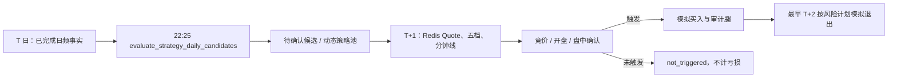

# 策略中心模块

## 定位

`strategy_center` 是本地日频事实驱动的短线策略研究、历史验证和模拟交易边界。它不调用 Provider、不连接券商、不自动下单；TickFlow Quote/五档和 MooTDX 分钟线只由既有实时底座写入 Redis 后供它读取。未被实际触发的候选不创建模拟交易，也不计为策略失败。

策略不是可在页面中随意编写的表达式。每个可执行规则都必须在 `builtins.py` 中实现并有回归测试；实现模板的确认时点和默认持有周期也是契约，不能在策略定义中单独改掉。页面只选择实现模板，并通过新版本调整公共市场门槛、候选上限和风控参数，避免未审计的 JSON 被执行。

## 相关源码

- `python-back/app/modules/strategy_center/builtins.py`：11 个固定内置实现、默认参数和风险计划。
- `python-back/app/modules/strategy_center/service.py`：版本状态机、T 日候选、日频回测和晋升校验。
- `python-back/app/modules/strategy_center/realtime_service.py`：只读 Redis/内存行情的次日确认与模拟退出。
- `python-back/app/modules/strategy_center/repository.py`、`models.py`、`schemas.py`、`api.py`
- `python-back/app/modules/strategy_center/scheduler_handlers.py`
- `web-admin/src/views/StrategyCenter.vue`
- `docs/sql/70-strategy-evaluation-lifecycle.sql`

## 内置策略与共同边界

当前内置模板为：`trend_breakout`、`bullish_alignment`、`ma_golden_cross`、`volume_price_surge`、`high_turnover_surge`、`low_volatility_leader`、`pullback_ma20_bounce`、`n_day_low_reversal`、`theme_first_board_relay`、`consecutive_limit_up_relay`、`broken_board_recovery`。

它们只使用已入库的日 K、日频因子、`daily_basic`、个股资金流、涨跌停/炸板事件、概念关系和 V2 情绪结果。共同排除 ST、北交所、非 active 股票、上市不足 60 个交易日及流动性不足标的；默认阻断冰点/退潮市场。模板给出的默认止损、分批止盈、移动止盈和最长持有期只是可验证的模拟规则，不是买卖建议，也不代表胜率。

尚未接入统一日频计算器的 MACD、RSI、KDJ、BOLL 等策略不会以名称形式伪装成可运行模板；先补齐指标、回测与测试，才能注册新实现。

## 数据模型与状态

| 表 | 层 | 作用 |
| --- | --- | --- |
| `t_strategy_definition` | Business | 策略名称、专属动态股票池、确认时点、最长持有期和整体状态。`paper` 仅表示存在纸面运行版本。 |
| `t_strategy_version` | Business / 审计 | 不可变的实现代码、规则/风险参数和验证摘要；状态为 `draft`、`backtest_ready`、`paper`、`retired`。 |
| `t_strategy_candidate` | Derived / 审计 | 某一策略版本在 T 日收盘生成的候选；唯一键为版本、信号日和股票。 |
| `t_strategy_signal_event` | Derived / 审计 | 候选生成/撤销、确认拒绝/触发、退出等可幂等事件证据。 |
| `t_strategy_paper_trade` | Business / 审计 | 仅实际触发买点后产生的模拟交易，保存初始/剩余数量和风险计划。 |
| `t_strategy_paper_trade_leg` | Business / 审计 | 每笔模拟买入、分批卖出和最终卖出腿。 |
| `t_strategy_backtest_run`、`t_strategy_backtest_trade` | Derived / 审计 | 可重放的日频基线回测及每笔结果。 |

定义状态为 `draft`、`research`、`paper`、`archived`，仅名称、说明和归档状态可直接维护；确认时点、持有周期、规则与风控都必须生成新版本。版本只有在实际历史覆盖区间中至少覆盖 120 个有效信号交易日、并产生至少 30 笔已完成交易后，才由回测任务标记 `backtest_ready`；前者防止短期冒烟样本因高频信号误解锁。晋升 `paper` 仍需要显式 API 操作，并会退休同一策略之前的纸面版本。候选依次为 `pending_confirmation/watching`、`entry_triggered`、`not_triggered`、`expired/cancelled`；只有 `entry_triggered` 才能有纸面交易。

## 运行链路



- T 日 evaluator 只读取本地事实，并把下一开市日写为确认截止日。
- `auction` 在 09:20–09:25 需要至少 3 份新鲜五档快照；`open` 在 09:30–09:35；`intraday` 在 09:35–14:50 需要至少 5 根分钟线。缓存过期、数据块降级、没有可执行卖一价、跳空越界或已验证涨停排队时只写拒绝/降级事件，不补拉 Provider。
- 成交价使用可执行盘口（买入看卖一，卖出看买一），模拟成本含回测传入的费率/滑点。中国 A 股 T+1 约束在执行器中强制：同一交易日不能退出；日频基线则是 T+1 开盘入场、最早 T+2 开盘按前一日收盘信号退出。
- 动态策略池只包含未过确认截止日的待确认候选、已触发候选和未平仓纸面交易，因此过期候选不会持续占用 TickFlow/MooTDX 实时资源。

## 回测口径

`run_strategy_backtest` 是日频、单信号独立样本基线：T 收盘筛选，T+1 开盘用日 K 开盘价与滑点模拟入场，随后以每日收盘判定止损/止盈/移动止盈/期限，下一开市日开盘模拟退出。它不模拟组合资金容量、盘口排队、撮合、停牌可成交性或真实订单，因此只能用于比较策略版本，不能声称为实盘收益预测。

回测按 5 个信号日分批提交，幂等键是版本、区间、费率和滑点；运行摘要先显示 `loading_inputs`（批次、信号日期范围、加载交易日数），再显示已完成信号日数。固定模板只加载当前 bar 加前 20 个交易日；数据库先以该固定规则的必要条件预筛选信号日股票，再返回“候选日完整字段 + 按股票聚合的最小日线序列”，避免云库连接把全市场明细逐行传给 `asyncpg`。最终是否命中仍由 Python evaluator 判定。批内版本参数和日期化历史序列复用；`daily_basic`、资金流只在信号日关联，历史行不读取完整因子 JSONB。缺失交易日按实际日期过滤，绝不将后续 bar 移入历史。完成交易少于 30 笔、或有效信号日少于 120 天的试跑保留统计但不得进入纸面审阅状态。

## API 与调度

API 均在 `/api/v1/strategies`：

| 接口 | 用途 |
| --- | --- |
| `GET /templates`、`POST /bootstrap-builtins` | 查询并初始化内置策略定义。 |
| `POST /`、`PATCH /{strategy_code}` | 创建或维护策略定义；规则参数的实质修改须创建版本。 |
| `GET/POST /{strategy_code}/versions`、`PATCH /{strategy_code}/versions/{version_no}` | 查询、创建或编辑草稿版本。 |
| `GET /{strategy_code}/backtests` | 返回该策略历史基线运行摘要，供人工按区间、样本日、结束交易数、胜率、平均/中位净收益和审阅门槛判断。 |
| `POST /{strategy_code}/versions/{version_no}/backtests` | 发起有界的日频基线回测。 |
| `POST /{strategy_code}/versions/{version_no}/promote-paper` | 显式晋升一个已验证版本到纸面运行。 |
| `GET /dashboard`、`GET /candidates` | 查询定义、版本运行态、候选和纸面交易摘要。 |

调度任务由 `scheduler_handlers.py` 注册：`evaluate_strategy_daily_candidates` 在工作日 22:25 运行，`run_strategy_backtest` 是仅手动任务。两者归入“策略”标签；候选任务只扫描 `paper` 定义及其 `paper` 版本，且依赖当天 V1 市场报告事实已就绪。

策略中心页面中，“新建参数版本”会从最近版本复制实现模板，并只暴露最低成交额、最低风险偏好分、候选上限、模拟数量、硬止损、两档止盈和时间退出；第二止盈必须高于第一止盈。创建后必须重新运行回测，旧版本及其候选不会被改写。“基线回测审阅”区直接展示每次运行的样本范围、有效信号日、结束交易数、胜率、平均/中位净收益与技术门槛，而非把“可人工审阅”误当作“应当提升 paper”。

## 部署与使用顺序

表 owner 先执行：

```sql
\i /root/sql/69-strategy-research-foundation.sql
\i /root/sql/70-strategy-evaluation-lifecycle.sql
```

再部署后端、刷新前端并 reload Scheduler。随后在策略中心初始化内置模板，选定版本后手动运行回测；只有人工审阅回测后再晋升纸面版本。`70` 不删除历史候选或模拟交易，只给原有定义补 v1 版本、收紧状态约束并新增审计/回测/调度结构。
