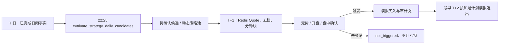

# 策略中心模块

## 定位

`strategy_center` 是本地日频事实驱动的短线策略研究、历史验证和模拟交易边界。它不调用 Provider、不连接券商、不自动下单；TickFlow Quote/五档和 MooTDX 分钟线只由既有实时底座写入 Redis 后供它读取。未被实际触发的候选不创建模拟交易，也不计为策略失败。

策略不是可在页面中随意编写的表达式。每个可执行规则都必须在 `builtins.py` 中实现并有回归测试；实现模板的确认时点和默认持有周期也是契约，不能在策略定义中单独改掉。页面只选择实现模板，并通过新版本调整公共市场门槛、候选上限和风控参数，避免未审计的 JSON 被执行。

## 相关源码

- `python-back/app/modules/strategy_center/builtins.py`：11 个固定内置实现、默认参数、可审计 selector 参数空间和风险计划。
- `python-back/app/modules/strategy_center/optimization.py`：不看未来的训练/样本外切分、样本量/稳定性门槛和排序。
- `python-back/app/modules/strategy_center/service.py`：版本状态机、T 日候选、日频回测、参数寻优和晋升校验。
- `python-back/app/modules/strategy_center/realtime_service.py`：只读 Redis/内存行情的次日确认与模拟退出。
- `python-back/app/modules/strategy_center/repository.py`、`models.py`、`schemas.py`、`api.py`
- `python-back/app/modules/strategy_center/scheduler_handlers.py`
- `web-admin/src/views/StrategyCenter.vue`
- `docs/sql/70-strategy-evaluation-lifecycle.sql`
- `docs/sql/71-strategy-parameter-optimization.sql`

## 内置策略与共同边界

当前内置模板为：`trend_breakout`、`bullish_alignment`、`ma_golden_cross`、`volume_price_surge`、`high_turnover_surge`、`low_volatility_leader`、`pullback_ma20_bounce`、`n_day_low_reversal`、`theme_first_board_relay`、`consecutive_limit_up_relay`、`broken_board_recovery`。

它们只使用已入库的日 K、日频因子、`daily_basic`、个股资金流、涨跌停/炸板事件、概念关系和 V2 情绪结果。共同排除 ST、北交所、非 active 股票、上市不足 60 个交易日及流动性不足标的；默认阻断冰点/退潮市场。模板给出的默认止损、分批止盈、移动止盈和最长持有期只是可验证的模拟规则，不是买卖建议，也不代表胜率。

尚未接入统一日频计算器的 MACD、RSI、KDJ、BOLL 等策略不会以名称形式伪装成可运行模板；先补齐指标、回测与测试，才能注册新实现。

## 数据模型与状态

| 表 | 层 | 作用 |
| --- | --- | --- |
| `t_strategy_definition` | Business | 策略名称、专属动态股票池、确认时点、最长持有期和整体状态。`paper` 仅表示存在纸面运行版本。 |
| `t_strategy_version` | Business / 审计 | 不可变的实现代码、规则/风险参数和验证摘要；状态为 `draft`、`backtest_ready`、`paper`、`retired`。 |
| `t_strategy_candidate` | Derived / 审计 | 某一策略版本在 T 日收盘生成的候选；唯一键为版本、信号日和股票。 |
| `t_strategy_signal_event` | Derived / 审计 | 候选生成/撤销、确认拒绝/触发、退出等可幂等事件证据。 |
| `t_strategy_paper_trade` | Business / 审计 | 仅实际触发买点后产生的模拟交易，保存初始/剩余数量和风险计划。 |
| `t_strategy_paper_trade_leg` | Business / 审计 | 每笔模拟买入、分批卖出和最终卖出腿。 |
| `t_strategy_backtest_run`、`t_strategy_backtest_trade` | Derived / 审计 | 可重放的日频基线回测及每笔结果。 |
| `t_strategy_optimization_run`、`t_strategy_optimization_trial` | Derived / 审计 | 一次参数研究的基线来源、时间切分、搜索空间、训练/验证统计、稳定性判定与排序；不改写策略版本。 |

定义状态为 `draft`、`research`、`paper`、`archived`，仅名称、说明和归档状态可直接维护；确认时点、持有周期、规则与风控都必须生成新版本。版本只有在按**实际候选上限**运行的历史区间中至少覆盖 120 个有效信号交易日、产生至少 300 笔已完成交易、胜率不少于 50% 且平均净收益为正后，才由回测任务标记 `backtest_ready`；这只是通过基本质量门槛，仍需人工审阅。晋升 `paper` 仍需要显式 API 操作，并会退休同一策略之前的纸面版本。候选依次为 `pending_confirmation/watching`、`entry_triggered`、`not_triggered`、`expired/cancelled`；只有 `entry_triggered` 才能有纸面交易。

## 运行链路



- T 日 evaluator 只读取本地事实，并把下一开市日写为确认截止日。
- `auction` 在 09:20–09:25 需要至少 3 份新鲜五档快照；`open` 在 09:30–09:35；`intraday` 在 09:35–14:50 需要至少 5 根分钟线。缓存过期、数据块降级、没有可执行卖一价、跳空越界或已验证涨停排队时只写拒绝/降级事件，不补拉 Provider。
- 成交价使用可执行盘口（买入看卖一，卖出看买一），模拟成本含回测传入的费率/滑点。中国 A 股 T+1 约束在执行器中强制：同一交易日不能退出；日频基线则是 T+1 开盘入场、最早 T+2 开盘按前一日收盘信号退出。
- 动态策略池只包含未过确认截止日的待确认候选、已触发候选和未平仓纸面交易，因此过期候选不会持续占用 TickFlow/MooTDX 实时资源。

## 回测口径

`run_strategy_backtest` 是日频、单信号独立样本基线：T 收盘筛选，T+1 开盘用日 K 开盘价与滑点模拟入场，随后以每日收盘判定止损/止盈/移动止盈/期限，下一开市日开盘模拟退出。它不模拟组合资金容量、盘口排队、撮合、停牌可成交性或真实订单，因此只能用于比较策略版本，不能声称为实盘收益预测。

回测按 5 个信号日分批提交，幂等键是版本、区间、费率、滑点和研究候选上限；运行摘要先显示 `loading_inputs`（批次、信号日期范围、加载交易日数），再显示已完成信号日数。固定模板只加载当前 bar 加前 20 个交易日；数据库先以该固定规则的必要条件预筛选信号日股票，再返回“候选日完整字段 + 按股票聚合的最小日线序列”，避免云库连接把全市场明细逐行传给 `asyncpg`。事件模板所需的涨停题材上下文则读取同日 `t_market_sector_heat_daily`，并在一次回测 session 内缓存同花顺概念成员关系，按成分有效期在内存关联；不会为每个批次重复执行“热点表 × 全量成分”的大关联，也不把未来题材关系带入历史日。最终是否命中仍由 Python evaluator 判定。批内版本参数和日期化历史序列复用；`daily_basic`、资金流只在信号日关联，历史行不读取完整因子 JSONB。汇总阶段只投影 `net_return_pct`，不再把每笔交易的大型候选/执行 JSON 快照重新传回 Python 后再统计。缺失交易日按实际日期过滤，绝不将后续 bar 移入历史。策略中心可选择 `baseline_candidate_limit`（最大 1000）运行“寻优基线”，从而避免实时 `selection.max_candidates` 截断可用于参数研究的候选；此类运行明确不能解锁 `paper`。只有按实际候选上限执行、且同时满足 120 信号日、300 笔、50% 胜率和正平均收益的运行才可进入人工纸面审阅。若用户或调度取消正在运行的回测，已提交的分批交易明细会被删除，`t_strategy_backtest_run` 保留为终态 `cancelled`，并记录清理的部分交易数量；取消运行绝不能作为寻优或纸面审阅输入。

### 历史参数寻优

`optimize_strategy_parameters` 是人工触发的研究任务，不是“找一个历史最高胜率数字”的功能。它必须引用同一不可变版本的一条已完成基线回测，并先检查该回测没有触及 `selection.max_candidates`：若某日候选已被上限截断，收紧参数后可能本应保留原先未落入基线的股票，因此任务会拒绝运行，要求把候选上限调高后重跑完整基线。

当前支持的空间只来自 `builtins.py` 明确列出的 selector 阈值，例如涨幅区间、量/额比、收盘位置、换手、主力净流入、波动率、题材排名、换手首板的开板次数与风险偏好门槛。每个候选只能比原基线**更严格**，故可使用已持久化的 `candidate_snapshot` 复放；放宽条件、改变突破/均线定义、改变持有期或止损止盈都必须新建版本并重新执行全量基线，不能被伪装成“优化结果”。

`theme_first_board_relay` 的历史 V1 在 `open_count` 缺失时保持原有兼容语义；新版本可显式配置 `signal.minimum_open_count`，只有已验证达到该次数的换手开板才命中。默认市场门槛仍只读取 `emotion.status=ready`；版本可通过 `market_gate.accept_degraded_score=true` 显式接受 V2 的 `degraded` 分数（核心事实已齐、北向等辅助确认延迟），而非把完全不可用的情绪结果误当作合格分数。两项均写入候选快照与回测参数快照，不能追溯改变 V1；回归测试覆盖降级分数仍须满足下限、开板次数不足被拒绝、达标后命中，以及 V1 缺失开板次数的兼容路径。

样本按**信号交易日**而不是交易笔数排序切分：默认前 70% 为训练，后 30% 为样本外验证，绝不交叉或使用未来事实。默认可复验门槛为训练至少 300 笔且 80 个信号日、验证至少 120 笔且 30 个信号日，训练胜率 ≥48%、验证胜率 ≥50%、两个区间平均净收益均为正、二者胜率差不超过 8 个百分点；同时记录 Wilson 95% 下界。样本不足、只在训练好看、验证为负或发生明显漂移都不会成为推荐结果。满足门槛的 trial 只可作为“创建新版本并全量回测”的候选，不能自动进入 `paper`。

未来的“AI 优化”按钮必须以此审计链为边界：LLM 只能读取脱敏/结构化的成功与失败样本、分段统计和当前参数，输出失败假设与**受限试验提案**；提案仍需由上述本地优化器与新版本全量回测验证，LLM 不拥有修改版本、提升 `paper` 或下单权限。尚未实现该按钮，以免在没有可复验约束时把自然语言建议当成参数结论。

## API 与调度

API 均在 `/api/v1/strategies`：

| 接口 | 用途 |
| --- | --- |
| `GET /templates`、`POST /bootstrap-builtins` | 查询并初始化内置策略定义。 |
| `POST /`、`PATCH /{strategy_code}` | 创建或维护策略定义；规则参数的实质修改须创建版本。 |
| `GET/POST /{strategy_code}/versions`、`PATCH /{strategy_code}/versions/{version_no}` | 查询、创建或编辑草稿版本。 |
| `GET /{strategy_code}/backtests` | 返回该策略历史基线运行摘要，供人工按区间、样本日、结束交易数、胜率、平均/中位净收益和审阅门槛判断。 |
| `GET /{strategy_code}/optimizations` | 返回历史参数寻优的运行、训练/验证摘要、稳定性指标与 trial 排序。 |
| `POST /{strategy_code}/versions/{version_no}/backtests` | 发起有界的日频基线回测。 |
| `POST /{strategy_code}/versions/{version_no}/promote-paper` | 显式晋升一个已验证版本到纸面运行。 |
| `GET /dashboard`、`GET /candidates` | 查询定义、版本运行态、候选和纸面交易摘要。 |

调度任务由 `scheduler_handlers.py` 注册：`evaluate_strategy_daily_candidates` 在工作日 22:25 运行，`run_strategy_backtest` 与 `optimize_strategy_parameters` 是仅手动任务。三者归入“策略”标签；候选任务只扫描 `paper` 定义及其 `paper` 版本，且依赖当天 V1 市场报告事实已就绪。

策略中心页面中，“新建参数版本”会从最近版本复制实现模板，并只暴露最低成交额、最低风险偏好分、候选上限、模拟数量、硬止损、两档止盈和时间退出；第二止盈必须高于第一止盈。创建后必须重新运行回测，旧版本及其候选不会被改写。“基线回测审阅”区直接展示每次运行的样本范围、有效信号日、结束交易数、胜率、平均/中位净收益与技术门槛，而非把“可人工审阅”误当作“应当提升 paper”。

## 部署与使用顺序

表 owner 先执行：

```sql
\i /root/sql/69-strategy-research-foundation.sql
\i /root/sql/70-strategy-evaluation-lifecycle.sql
\i /root/sql/71-strategy-parameter-optimization.sql
```

再部署后端、刷新前端并 reload Scheduler。随后在策略中心初始化内置模板，先以高于可能单日候选数的上限运行完整基线；再运行“历史参数寻优”，选择样本量和样本外表现都通过的候选创建新版本并全量复验。只有人工审阅复验后再晋升纸面版本。`70/71` 不删除历史候选或模拟交易，`71` 只新增研究审计结构。
