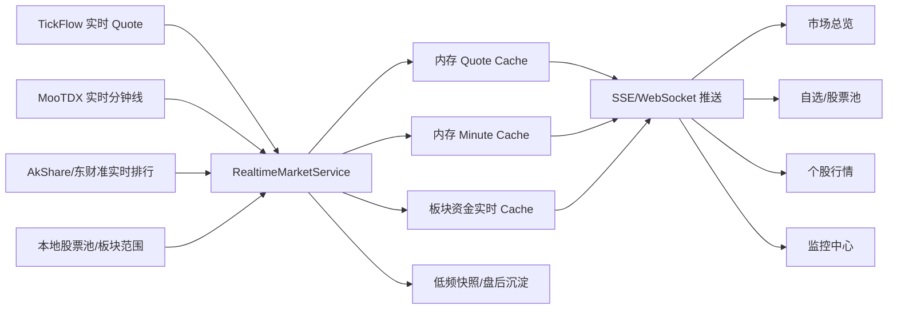

# 实时数据能力规划
<!-- wiki-migration -->

## 一句话理解

`stock-center` 必须把“实时数据、准实时数据、盘后数据、历史数据”明确分层。实时数据底座由统一的 `RealtimeMarketService` 维护：TickFlow 提供实时 Quote，MooTDX 继续提供实时分钟线；后续页面和监控不得各自直接调用外部行情源。

## TickFlow 的实时链路

对标项目的实时能力不是单个页面临时查询，而是一个常驻服务：

- `QuoteService` 轮询全市场或关注范围的 quote，维护内存 enriched cache。
- `DepthService` 拉取五档盘口，用于判断封单、炸板和涨跌停深度。
- 后端通过 SSE 向前端推送 `quotes_updated`、`depth_updated`、`strategy_alert` 等事件。
- Dashboard、Watchlist、Monitor 使用同一份实时缓存，不重复请求外部源。
- 盘后再把可沉淀的数据写入本地数据文件，实时缓存和历史资产边界清晰。

这意味着 TickFlow 的“实时”主要指盘中 quote、分时、盘口和监控事件；财务、日线、指标流水线仍然是历史或盘后数据。唯一的日频例外是 `daily_close_core_ingest` 的七个核心指数：收盘后可用 TickFlow 单指数未复权日 K 先补当日 bar，缺失时才交给 Tushare；它不是全市场日频事实的替代来源。

## stock-center 当前实时边界

| 能力 | 当前实现 | 实时性 | 问题 |
| --- | --- | --- | --- |
| 个股实时 quote | `RealtimeMarketService` 的全市场 TickFlow `quotes.get_by_symbols` 缓存 | 默认 60 秒准实时 | Redis/内存覆盖缓存，SSE 推送给当前详情页；不写 PostgreSQL。 |
| 个股当日分时 | `RealtimeMarketService` 的优先目标 MooTDX `minute()` 缓存 | 60 秒准实时 | 每分钟保障 200 只，超出后按优先级轮转；不沉淀到实时表。 |
| 历史分钟线 | `t_minute_bar` | 历史/盘后 | 依赖收盘沉淀或回填任务。 |
| 日 K | `t_daily_bar` | 盘后/历史 | 依赖 Tushare 日线沉淀。 |
| EOD quote | 已废弃 | 盘后快照 | 与 `t_daily_bar` 重复，不再作为实时或日频事实。 |
| 板块资金大屏 | AkShare/东财即时板块资金流 | 准实时 | 页面轮询，不是统一实时服务。 |
| 板块详情行情 | Tushare `ths_daily` | 日频/盘后 | 不能当成分钟级实时行情。 |
| 板块资金曲线 | Tushare `moneyflow_cnt_ths/moneyflow_ind_ths` | 日频/盘后或延迟 | 适合历史曲线，不适合 1 分钟真实资金流。 |
| 个股/板块因子 | `t_stock_factor_daily`、`t_sector_factor_daily` | 盘后 derived | 不应该被标成实时。 |
| 监控触发 | 尚未实现 | 缺失 | 需要统一实时服务触发。 |
| 全市场实时缓存 | 已实现 V1 | 60 秒准实时 | 全市场 quote、板块强度、股票池汇总和优先分钟线共用一份缓存。 |

## 已实现：REST 轮询稳态底座

源码位置：

```text
python-back/app/modules/realtime_market/
python-back/app/core/redis_client.py
docs/sql/53-realtime-market-runtime.sql
docs/sql/60-tickflow-realtime-quote.sql
```

- FastAPI 生命周期启动 `RealtimeMarketService`；配置对象为 `market_data/realtime_market`，默认 `enabled=false`。TickFlow API Key 独立保存在 `market_data/tickflow` 敏感值池；没有可用 Key 时 Quote 轮次明确失败，不会静默回退到 MooTDX。
- 只在 `t_trade_calendar` 标记为 CN 开市时自动运行：TickFlow Quote 覆盖 `09:15-11:30` 和 `12:55-15:00`，MooTDX 分钟线仅在连续竞价 `09:30-11:30`、`13:00-15:00` 获取；手动 `POST /api/v1/realtime/refresh?force=true` 可用于诊断。
- 全市场 Quote 每 60 秒只调用一次 TickFlow `quotes.get(universes=["CN_Equity_A"])`，50 只限制只适用于按 `symbols` 批量接口。运行时本地过滤沪深 `active + 非 ST`，成功轮次以单一 `round_id` 同时生成市场、题材、申万行业和股票池聚合，绝不混入前一轮缓存。
- 分钟线继续采用默认 6 个、上限 8 个相互独立的 `MootdxProvider` 连接调用 `minute(symbol)`。目标由 `t_stock_pool_realtime_policy` 显式决定，不再按股票代码从全市场补齐：最多登记 500 只，每轮最多保障 200 只；保障目标超过 200 时以 `guaranteed_overflow` 明确展示，再按轮转补位。
- 空分时单独记录为 `no_intraday_data`，不触发错误重试；连接异常、超时和 Provider 错误单独计数。
- MooTDX 当前分钟响应只有 `price/vol`，没有 `amount/avg_price`。V1 仅计算 1/5/15 分钟收益、分钟成交量、量能突增、分时趋势、盘中突破和盘中强度；明确不伪造 VWAP、分钟成交额或成交额放量。
- Redis 不可用时复用 `RedisClient` 的内存降级缓存；分钟线使用每股票、每分钟字段的 Redis Hash 增量写入，首次写完整序列，后续只写新增或变化 bar。`GET /api/v1/realtime/status` 与数据中心 `/api/v1/data-assets/realtime-health` 会显示 `memory_fallback` 和错误摘要。
- SSE 端点为 `GET /api/v1/realtime/stream?topics=market_overview,sectors,pool:focus,stock:600519`。个股行情页仅在“实时分时”页签开启自动刷新时订阅 `stock:{stock_code}`，连接失败后退回 60 秒轮询。

实时数据永远不写 `t_quote_snapshot` 或 `t_minute_bar`：盘后 `daily_close_core_ingest` 仍是历史分钟线唯一沉淀入口。

## 第一期已实现：REST 轮询 + 五档深度（执行 61、63 迁移后启用）

`docs/sql/61-realtime-research-foundation.sql` 与 `realtime_market` 的实现把 V1 收口为个人研究使用的 REST 轮询底座；不接 TickFlow WebSocket、不做自动下单。

- **全市场**：仅由持有 Redis 租约的实例每 60 秒调用 TickFlow `CN_Equity_A` 标的池 Quote 一次；本地再过滤 `active + 沪深 + 非 ST`，形成市场宽度、Tushare 概念热点、TickFlow 申万行业和股票池聚合。覆盖门槛按活跃股票数的 95% 向上取整；未达标时保留上一轮聚合缓存。其他进程只读 Redis，不能重复消耗额度。
- **候选与五档**：不再把 `pool_code` 写死为业务优先级。每个股票池有一条实时策略（开关、优先级、Quote 档位、分钟档位）；默认 `holding/focus/candidate/breakout_retake` 已 seed 为可解释策略，页面关注为 120 秒临时热/保障目标，强势股只从最近一轮合格的全市场 Quote 派生，并作为最低优先级温/轮转补位。热池最多 200 只，Quote/五档连续交易默认 10 秒，`09:20–09:25` 五档改为 5 秒；超出的热目标进入温观察池，60 秒更新。五档仅走批量接口，Redis 保留当前加最近 3 次、TTL 30 秒。
- **分钟线**：MooTDX 默认 6 个独立连接（上限 8），单股票异常只隔离自身；网络抓取与 Redis pipeline 写入通过生产者/消费者并行。分钟 K 仍为 1 分钟刷新，不购买 TickFlow 分钟 K。
- **额度**：配置中心的购买上限实际生效：标的 Quote `60/min, 50/次`、标的池 `20/min`、批量深度 `60/min, 200/次`，运行时各按 90% 安全预算（54/18/54）令牌桶执行。每分钟固定预留全市场 1 请求、热池最多 24、核心指数 1、页面按需 5，余下最多 24 请求用于温观察；429 读取服务端冷却提示，保留上一份成功缓存。
- **权限测试**：TickFlow 测试不再只测单股，依次验证 `CN_Equity_A`、50 只批量 Quote、200 只批量五档。缺少付费权限只累积失败，不会把有效 Key 标为 `invalid`，也不会静默降级使用旧的 5 只限额。
- **三层分类**：`t_sector_basic/t_sector_component` 的 Tushare 概念为题材主层；`t_market_universe/t_market_universe_member` 保存 TickFlow 原始标的池与 SW1/SW2/SW3 成员有效期；`t_stock_pool/t_stock_pool_member` 仅为系统、策略、用户观察范围。三者不可互相替代。
- **可观测性**：`GET /api/v1/realtime/status` 提供 market/decision_quote/depth/minute 四个独立状态、覆盖率、耗时、随查询实时计算的缓存年龄、错误、额度使用、Redis 租约、分钟保障溢出和未登记数；`GET /api/v1/realtime/depth`、`/decision-targets` 返回缓存结果，页面不绕过限频直连外部源。
- **界面与目录 API**：数据中心展示额度、四个状态块、分钟目标分布和统一轮次的市场总览（宽度、成交额、涨跌分布、七大指数）。独立 `/market-overview` 通过同一缓存和 SSE 展示概念主层、申万行业辅助层、股票池、盘中宽度时间线和短期事件流；时间线最多 260 点、事件最多 120 条，仅按交易日短期保存 Redis/内存。独立 `/post-close-market` 页面以 `/realtime/post-close-structure` 只读最新完成日的涨停梯队和炸板事实：服务端验证 `limit_list_d` Raw 完成标记，按 `t_trade_calendar` 连续开市日统计 `limit_up`；完成结果缓存 300 秒、未完成状态缓存 60 秒，页面每 60 秒检查一次。它不属于实时 Quote、不会消耗 TickFlow 额度。股票池中心在新建 / 编辑弹窗中一次保存池状态和实时策略，详情只显示易读摘要；系统预置池可配置运行方式但不可改名或删除。目录 API 继续按系统池、策略池、用户池、Tushare 题材、TickFlow 行业切换。`/profiles/{stock_code}` 返回概念、Tushare 行业、SW 行业、股票池和是否可参与情绪/策略。

执行迁移需要 `t_stock` 等表的 owner/DBA 权限；应用账号无权 DDL 时会整体回滚，不应拆分手动执行一部分。

## 数据源实时性分层

| 数据源 | 适合实时的数据 | 不适合实时的数据 | 角色 |
| --- | --- | --- | --- |
| TickFlow | 全市场/个股实时 Quote、开盘前后会话状态、当日七核心指数单标的日 K | 财务、全市场/历史日频事实、未经实测的盘口/竞价字段 | 实时 Quote 主源；核心指数当日 K 的受限补充源。 |
| MooTDX | 个股实时分钟线、历史分钟线、指数 fallback | 财务、板块资金、公告 | 实时分钟线主源。 |
| AkShare/东财 | 实时行情补充、板块资金排行、市场排行 | 高可靠历史事实主源 | 准实时排行和 fallback。 |
| Tushare | 日线、daily_basic、资金流、龙虎榜、板块日线、财务 | 盘口、分笔、分钟级实时 | 盘后 canonical 主源。 |
| Skill/问财/妙想/Kimi | 语义查询、资讯、事件、新闻、专题解释 | quote、盘口、分时、分钟资金流 | 分析上下文补充，不作为市场实时源。 |

Skill 的“实时”只是“调用当下返回最新搜索结果”，不是稳定行情实时源。价格、盘口、分时、涨跌幅、资金排行不能依赖 Skill 做主源；Skill 更适合查“为什么涨”“新闻是什么”“题材解释”等语义信息。

## 目标实时架构



核心原则：

- 实时服务只维护内存状态，默认不高频写库。
- 盘中展示用实时缓存；盘后分析用 canonical/derived 表。
- 默认不保存实时 quote 到 canonical；只保存监控触发记录、低频审计摘要，或未来单独设计的短保留实时审计表。
- 页面离开后停止订阅；服务端可以继续维护核心观察范围。
- 全市场实时拉取要分阶段做，先从股票池、核心指数、强势板块开始。

## 实时数据范围

第一批范围：

- 核心指数 quote：上证综指、深证成指、创业板指、沪深300、中证500、中证1000、上证50。
- 全市场 quote：沪深 active、非 ST 股票；使用 TickFlow `CN_Equity_A` 标的池单请求轮询，再本地过滤，不按 50 只 symbols 限制拆批。
- 股票池 quote：`candidate/focus/holding/breakout_retake/all_a_share` 中人工池可用更高刷新频率。
- 个股页面实时：当前打开股票的 quote、盘口、分时。
- 板块大屏：概念/行业资金排行和涨跌幅排行，每 60 秒刷新。

第二批范围：

- 连板梯队所需的涨停、炸板、封单和盘口深度。
- 监控规则所需的价格涨跌、放量、资金流排行、板块异动。
- 可配置观察范围：股票池 + 板块 + 手动关注股票。
- 股票池实时聚合：对用户自定义的 `PCB/CPO/半导体` 等主题池，基于 quote cache 聚合涨跌幅、成交额、上涨家数、领涨/领跌、资金流和板块标签分布。

第三批范围：

- 分笔成交和盘口微观结构指标。
- 实时策略信号和通知触发。

## MooTDX quote_batch 历史压测（不再作为 Quote 路由依据）

2026-07-05 对当前库 active 沪深股票做了一次轻量只读压测：

| 项目 | 结果 |
| --- | --- |
| active 沪深股票 | 5210 只 |
| MooTDX 版本 | `0.11.7` |
| 单批安全上限 | 80 只 |
| 超过 80 的行为 | 请求成功但每批只返回 80 条，会静默截断 |
| 全市场批次 | 66 批 |
| 全市场一轮耗时 | 约 8.9 秒 |
| 失败批次 | 0 |
| 单批 p50 | 约 0.064 秒 |
| 单批 p95 | 约 0.286 秒 |

这份压测只保留为 MooTDX 历史 Quote 能力记录；当前实时 Quote 已切至 TickFlow，不能据此推导 TickFlow 的批量限制、耗时或可用性。TickFlow 需要在配置有效 API Key 后做盘中实测，验证覆盖率、延迟、会话字段及成交量/成交额单位。

当前保守配置：

| 参数 | 默认值 | 说明 |
| --- | --- | --- |
| `quote_batch_size` | 80 | TickFlow 初始批量大小；盘中实测后再调整。 |
| `full_market_interval_seconds` | 60 | 全市场 Quote 默认刷新间隔。 |
| `stale_after_seconds` | 180 | 超过该时间未成功刷新则标记 stale。 |
| `round_failure_threshold` | 5% | 本轮缺失超过阈值时保留上一轮缓存并降级提示。 |

不得把旧 MooTDX 的 66 批和耗时估算迁移到 TickFlow。配置有效 API Key 后，先在盘中记录一轮的有效覆盖率、批次耗时和响应字段，再决定是否提高批量大小或缩短刷新周期。

## 缓存设计

第一版缓存优先写 Redis；Redis 不可用时使用进程内内存，不高频写库：

| 缓存 | Key | Value | 生命周期 | 是否入库 |
| --- | --- | --- | --- | --- |
| `quote_cache` | `stock_code` | 标准化实时 quote | 每轮覆盖 | 否 |
| `quote_round_meta` | 固定 key | 本轮开始/结束、成功数、失败数、provider、耗时 | 每轮覆盖 | 只写日志摘要 |
| `sector_member_map` | `sector_code` | 成分股代码列表 | 启动加载，板块同步后刷新 | 来源是 `t_sector_component` |
| `stock_sector_map` | `stock_code` | 所属板块列表 | 启动加载，板块同步后刷新 | 来源是 `t_sector_component` |
| `sector_strength_cache` | `sector_code` | 聚合后的板块实时强度 | 每轮 quote 后重算 | 否 |
| `market_breadth_cache` | 固定 key | 涨跌分布、涨跌家数、排行、成交额 | 每轮 quote 后重算 | 否 |
| `minute_cache` | `stock_code` | 当前打开或关注股票的分时 | 页面/订阅驱动，容量限制 | 否 |
| `order_book_cache` | `stock_code` | 重点池/涨停候选的盘口 | 低频刷新，容量限制 | 否 |

热缓存不保存全量 `raw_payload`。`raw_payload/order_book.raw_levels` 只保留在调试样本或单股详情响应中，避免全市场 raw 把内存放大数倍。

## 板块聚合规则

实时板块强度不依赖外部“实时板块接口”，而是按 tickflow 的思路聚合：

```text
TickFlow 全市场 Quote cache
    +
t_sector_component 当前成分关系
    +
t_sector_basic 板块名称/类型
    ↓
sector_strength_cache
```

当前库规模：

| 数据 | 当前数量 |
| --- | ---: |
| Tushare 板块 | 1003 个 |
| 概念板块 | 409 个 |
| 行业板块 | 594 个 |
| 当前成分关系 | 104,976 条 |

每轮全市场 quote 成功后，按板块计算：

- `component_count`：成分数量。
- `quoted_count`：本轮有有效 quote 的成分数量。
- `avg_change_pct`：平均涨跌幅。
- `median_change_pct`：中位涨跌幅。
- `up_count/down_count/flat_count`：上涨、下跌、平盘数量。
- `strong_up_count/strong_down_count`：涨幅大于 3%、跌幅小于 -3%。
- `limit_up_count/limit_down_count`：仅在 TickFlow Quote 返回可验证的涨跌停价时统计；否则明确标记不可用，不按 9.9% 等阈值伪造。
- `total_amount_yuan`：成分股成交额合计。
- `leader/laggard`：领涨股、领跌股。
- `valid_ratio`：有效 quote 覆盖率。
- `strength_score`：综合强度分，基于平均涨幅、上涨比例、强势股比例和成交额分位。

板块资金流单独处理：

- 实时强度：TickFlow 个股 Quote 聚合。
- 准实时资金流：AkShare/东财板块资金接口。
- 盘后资金流：Tushare `moneyflow_cnt_ths/moneyflow_ind_ths`。
- 热点解释：Skill/问财/妙想/Kimi。

## 股票池实时聚合规划

股票池不是指数或板块的替代品，而是用户和策略的主观观察范围。指数、板块是外部客观分类；股票池是用户主动构建的作战范围，例如候选观察池、重点监控池、持仓监控池、断板反包池，以及自定义的 `PCB`、`CPO`、`半导体`、`机器人` 等主题池。

股票池实时工作台必须在 `RealtimeMarketService` 之后实现，不应让股票池页面逐行调用 MooTDX。推荐链路：

```text
t_stock_pool / t_stock_pool_member
    +
RealtimeMarketService 的 TickFlow quote cache
    +
canonical/derived 盘后数据
    ↓
stock_pool_realtime_summary
```

第一版股票池聚合指标：

- `member_count`：池内股票数。
- `quoted_count`：本轮有有效 quote 的股票数。
- `avg_change_pct`、`median_change_pct`：平均/中位涨跌幅。
- `up_count/down_count/flat_count`：上涨、下跌、平盘数量。
- `strong_up_count/strong_down_count`：强势上涨/下跌数量。
- `limit_up_count/limit_down_count`：仅在 TickFlow Quote 返回可验证涨跌停价时输出；缺少该字段时池汇总明确不可用。
- `total_amount_yuan`：池内成交额合计。
- `leader/laggard`：领涨股、领跌股。
- `fund_flow_summary`：最新盘后或准实时资金流聚合。
- `sector_distribution`：池内概念/行业标签分布。
- `valid_ratio`：实时 quote 覆盖率。

这套能力后续同时服务：

- 股票池工作台：用户观察自己关心的一篮子股票。
- 监控中心：对某个池设置涨幅、放量、资金流或异动规则。
- 选股/策略验证：把策略结果池作为观察范围，跟踪后续涨跌和信号命中率。
- 市场总览：展示重点池和候选池的实时表现。

股票池聚合默认只保留内存状态，不复制行情字段到 `t_stock_pool_member`。需要持久化的是监控触发记录、策略运行结果和用户维护的成员关系。

## 内存预算

按照当前 5210 只股票、1003 个板块、104,976 条成分关系估算：

| 模块 | 保守估算 | 说明 |
| --- | ---: | --- |
| 标准化 `quote_cache` | 8-20 MB | 只存规范字段，不存全量 raw。 |
| `quote_round_meta` 和错误样例 | <1 MB | 仅保留最近若干轮摘要。 |
| `sector_member_map` + `stock_sector_map` | 10-40 MB | 用字符串 list 会偏大；用内部整数 id 可降到 5-15 MB。 |
| `sector_strength_cache` | 1-5 MB | 1003 个板块 × 聚合指标。 |
| 最近 3-5 轮 quote ring | 30-100 MB | 用于对比变化、监控去抖；可配置关闭或缩小。 |
| 分时/盘口缓存 | 10-50 MB | 只给当前页面、重点池、涨停候选，不做全市场。 |
| 合计第一版 | 50-150 MB | Python dict 实现的合理范围。 |

内存红线：

- 不缓存全市场分笔。
- 不缓存全市场盘口。
- 不为全市场保存完整 `raw_payload`。
- 不保存全天所有 quote 轮次；最多保留最近 3-5 轮。
- 需要持久化的只写监控触发记录和低频审计摘要；实时 quote 缓存默认不入 canonical。

如果后续全市场实时因子变复杂，再考虑把 cache value 从 Python dict 优化为 `dataclass(slots=True)`、`pydantic` 轻量模型、`polars.DataFrame` 或 numpy 数组，降低对象开销。

## 页面实时标注

前端必须明确展示数据口径：

| 标签 | 含义 | 示例 |
| --- | --- | --- |
| 实时 | MooTDX/实时服务刚获取的盘中行情 | quote、盘口、分时。 |
| 准实时 | 来自 AkShare/东财排行，可能有延迟 | 板块资金大屏、热门排行。 |
| 盘后 | 收盘后由调度沉淀的日频事实 | 日线、daily_basic、资金流、龙虎榜。 |
| 历史 | 已入库历史数据 | 历史分钟线、历史日 K、回测数据。 |
| 待修复 | 依赖晚间增强或修复任务补齐 | `stk_factor_pro`、部分板块资金。`cyq_perf` 不再批量沉淀，个股详情如需要则按需查询。 |

## 后续实施阶段

### A. 实时底座

- 新增 `RealtimeMarketService`。
- 支持 quote cache、minute cache、sector realtime cache。
- 支持按 scope 订阅：股票池、单股、核心指数、板块大屏。
- 统一限频、失败重试、provider fallback 和日志。

### B. 推送接口

- 新增 SSE 或 WebSocket。
- 前端市场总览、自选、个股页统一订阅。
- 页面不可见或切走页签时自动暂停订阅。

### C. 监控接入

- 监控规则读取实时 cache，不直接调用 MooTDX。
- 触发记录入库，通知走 Notification Runtime。
- 冷却、去重、严重级别在监控模块处理。

### D. 盘后快照归档

- 实时服务不替代 `daily_close_core_ingest`。
- 收盘后由调度写分钟线和技术快照；技术快照从 `t_daily_bar + t_minute_bar + 因子表` 计算。
- 监控触发记录可以引用当时实时快照摘要。

### E. Skill 补充

- Skill 只作为事件解释和新闻补充。
- 例如监控触发后，可由 Skill 查新闻或问财原因，但不能决定 quote 是否上涨。

## 与每日沉淀的关系

- 实时服务回答“现在正在发生什么”。
- 每日收盘沉淀回答“今天最终事实是什么”。
- 指标流水线和回测读取盘后 canonical/derived 数据。
- 盘中监控读取实时 cache，并把触发结果持久化。
- 二者不能混用：实时 cache 不作为回测事实，盘后因子不假装实时。
